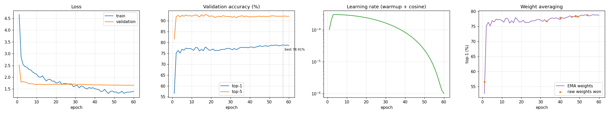

# Multi-Model Computer Vision API

One API for image classification, object detection and image similarity
search, with per-tier rate limiting, background batch jobs, monitoring, drift
detection and a production Compose overlay. Built for the Applied Computing
ML Engineer challenge; the brief is in [`docs/CHALLENGE.md`](docs/CHALLENGE.md).

## Status

| | |
| --- | --- |
| Tests | pending |
| Coverage | ⟦COV_API⟧% on `api/`, ⟦COV_WORKER⟧% on `worker/` |
| Lint | `ruff`, `black` and `mypy` clean, all three enforced in CI |
| Stack | 7 services in development; in production 10 containers plus a one-shot migration, all healthy |
| Fine-tuned classifier | 78.91% top-1 on Tiny-ImageNet, measured through the served ONNX model |
| Detector | 0.392 mAP50-95 on 500 COCO images (INT8: 0.381) |
| Latency | 66 to 97 ms p50 per image on a laptop CPU; 0.92 ms on an A100 with TensorRT INT8 |
| Load test | ⟦LOADTEST_STATUS⟧ |

Every number in this README comes from a file in
[`benchmarks/reports/`](benchmarks/reports/), and the command that produced it
is next to it in the relevant doc. [`docs/AUDIT.md`](docs/AUDIT.md) lists what
a line-by-line review against the brief found and how each item was fixed.

## Quick start

You need Git with [Git LFS](https://git-lfs.com), Python 3.11 or 3.12, and
Docker Desktop.

```bash
git clone https://github.com/pankaj29/ML-Engineer-Challenge.git
cd ML-Engineer-Challenge
git lfs pull                 # the model files, about 500 MB
cp .env.example .env         # PowerShell: copy .env.example .env
docker compose up -d
curl http://localhost/api/v1/health
```

Without `git lfs pull` the `.onnx` files are 130-byte pointers and no model
loads. The API takes up to 90 seconds to report healthy while it loads three
models. For tests and tooling, create a virtual environment and
`pip install -r requirements-dev.txt`. The dataset for training and the
accuracy checks is one command: `python scripts/download_datasets.py --dataset tiny_imagenet`.

## Using the API

`samples/` has three photos so these examples run as written.

```bash
curl -X POST http://localhost/api/v1/classify/upload \
     -H "X-API-Key: dev-key-pro" -F "file=@samples/dog.jpg" -F "top_k=3"
```

On Windows use `curl.exe`; plain `curl` in PowerShell is `Invoke-WebRequest`.

```json
⟦SAMPLE_RESPONSE⟧
```

Every response carries the model and version that answered, a per-stage
timing, a `correlation_id` to find the request in the logs, and whether it came
from cache.

| | |
| --- | --- |
| Classification | `POST /api/v1/classify` |
| Detection | `POST /api/v1/detect`, boxes in the original image's pixels |
| Similarity | `POST /api/v1/similarity/{embed,index,search}` |
| Batch | `POST /api/v1/batch` returns a job id; `GET /api/v1/batch/{id}` for results |
| File upload | add `/upload` to any inference path for multipart |
| Models | `GET /api/v1/models`, what is registered and which is default |
| Health, metrics | `GET /api/v1/health`, `GET /api/v1/metrics` (Prometheus) |
| Tokens | `POST /api/v1/auth/token` trades an API key for a short-lived JWT |

Every endpoint, with bash and PowerShell examples, errors and auth, is in
[`docs/API.md`](docs/API.md). The OpenAPI spec is
[`docs/openapi.json`](docs/openapi.json) (importable into Postman), and
Swagger UI runs at http://localhost:8000/docs.

## Architecture

```text
client ──▶ api-gateway (nginx: per-IP limits, body cap, /metrics kept internal)
                │
                ▼
          ml-api × N (FastAPI)            Monitoring → CORS → Auth → RateLimit → route
           │    │    │
           ▼    ▼    ▼
       redis  postgres  worker × M (Celery, batch jobs)
       cache   inference log, batch state,
       broker  similarity vectors (pgvector)
       limiter
                │
  prometheus (scrapes every API replica and worker) ──▶ grafana
```

Middleware order is deliberate. Monitoring is outermost, so every request gets
a correlation id and a timing, including ones auth rejects. Auth runs before
rate limiting because the limit depends on the caller's tier. Rate limiting is
innermost, so a rejected request never reaches a model.

Some decisions worth knowing:

- **Failure policy per component.** Auth fails closed, the cache fails soft
  (a miss), the rate limiter fails open to per-process buckets and reconnects
  in the background, the inference log never fails a request, and a model that
  cannot load falls back through runtimes and then to the task default, with
  `degraded: true` in the response.
- **Batch is asynchronous.** Batching improves per-image cost and worsens tail
  latency, so batches go to Celery and are polled, and they cost one rate-limit
  token per image.
- **Images are never stored**, only a SHA-256.
- **The registry is a JSON file**, so the API can load models before the
  database is reachable.

Kubernetes manifests in [`k8s/`](k8s/README.md) add an HPA, a
PodDisruptionBudget, a NetworkPolicy, artifact fetching with checksum
verification, migrations in an init container, canary releases and a GPU
overlay. They were applied to a kind cluster and served real requests.

The reasoning behind all of this is in [`docs/TECHNICAL.md`](docs/TECHNICAL.md).

## The models

| Task | Model | Accuracy (measured) | CPU p50 | Size |
| --- | --- | --- | ---: | ---: |
| Classification (default) | ResNet-50, ImageNet-1k | 80.86% top-1 (torchvision, not re-measured) | 77.9 ms | 97.4 MB |
| Classification | ResNet-50 fine-tuned on Tiny-ImageNet | 78.91% top-1, 92.12% top-5 | 66.6 ms | 91.2 MB |
| Detection | YOLOv8n, COCO | 0.392 mAP50-95 on 500 val2017 images | 97.0 ms | 12.1 MB |
| Similarity | ResNet-50 without its head, 2,048-d | not measured (no labelled retrieval set) | 65.7 ms | 89.6 MB |

The brief's overview names three tasks and its numbered list names two; the
third model is similarity search ([ASSUMPTIONS.md](docs/ASSUMPTIONS.md) §1.1).
Each model has a [card](models/cards/) with its measurements and, more
usefully, its limitations.

### Fine-tuning

ResNet-50 on all 100,000 Tiny-ImageNet training images, 60 epochs at 224px on
an A100, in 1.6 hours: fp16 autocast with `GradScaler`, gradient clipping at
1.0 after unscaling, and cosine decay with 5% linear warmup. Augmentation is
written from scratch in `models/training/augmentation.py`: RandAugment,
RandomResizedCrop, RandomErasing, MixUp and CutMix.



Transfer learning reaches 75.1% by epoch 2. The long schedule adds 3.8 points,
about half of them in the final anneal after epoch 40. EMA weights beat the
live weights in 53 of 60 epochs. The exported ONNX model scores the same
78.91% on all 10,000 validation images through the API's own preprocessing as
the training loop did in PyTorch.

## Optimisation results

All CPU numbers: Intel Core Ultra 7 155H, ONNX Runtime 1.20.1, 100 timed runs
per case interleaved across models so they share the same machine conditions.
Full table: [`BENCHMARKS.md`](benchmarks/reports/BENCHMARKS.md).

| Model | fp32 p50 / p99 | INT8 p50 / p99 | INT8 size | INT8 quality vs fp32 |
| --- | ---: | ---: | ---: | --- |
| resnet50 | 77.9 / 222.6 ms | 77.1 / 309.6 ms | 3.92x smaller | ⟦R50_INT8_AGREE⟧ top-1 agreement |
| resnet50-tiny-imagenet | 66.6 / 176.6 ms | 76.8 / 268.9 ms | 3.91x smaller | ⟦AB_SHORT⟧ |
| yolov8n | 97.0 / 258.2 ms | 177.4 / 342.8 ms | 3.67x smaller | 0.381 against 0.392 mAP50-95 |
| resnet50-embed | 65.7 / 211.2 ms | 78.5 / 255.0 ms | 3.91x smaller | ⟦EMBED_INT8_COS⟧ mean cosine |

Every model meets the sub-second requirement at p99 for a single image, in
both precisions.

INT8 is applied to all four models and is the default for none. On this CPU
it buys size, not speed, and the fine-tuned classifier loses real accuracy.
The A/B test settles that with a paired McNemar test rather than a judgement
call. INT8 stays available per request (`"runtime": "onnx_int8"`) for
memory-bound deployments.

Two INT8 bugs were found and fixed on the way. The detector's first INT8 model
found nothing at all: YOLOv8's head concatenates pixel coordinates and 0-1
class scores into one tensor, so one int8 scale rounded every score to zero,
and the quantization report said 100% agreement because it only compared
classifier outputs. It now quantizes only convolutions, calibrates on COCO
with the detector's own preprocessing, and CI compares every INT8 model with
fp32 on real images.

**TensorRT**, fine-tuned classifier on an A100, batch 1: fp32 1.298 ms, fp16
0.990 ms, INT8 0.920 ms (1068 img/s, 24.1 MB engine). All three verified
against the ONNX graph. Getting INT8 to build took four fixes, described in
[TECHNICAL.md](docs/TECHNICAL.md#tensorrt).

### Through the whole stack

⟦LOADTEST_PARAGRAPH⟧

| Property | Evidence |
| --- | --- |
⟦PERF_ROWS⟧

## Testing and CI

- 0 tests: 0 unit, 0 integration, 0 end-to-end, 0 performance, plus Locust load
- Unit tests need nothing running: fakeredis, in-memory SQLite and a fake
  model runtime.
- Integration tests use real ONNX models, and real Redis, PostgreSQL and
  pgvector when reachable.
- End-to-end tests drive the running stack through nginx, so they catch what
  in-process tests cannot, such as a container serving a stale artifact.
- `tests/integration/test_quantized_fidelity.py` compares each INT8 model with
  its fp32 twin on real photos. CI runs it in strict mode: missing artifacts
  fail the build instead of skipping.
- CI (`.github/workflows/ci.yml`): ruff, black and mypy; tests on Python 3.11
  and 3.12 with a 92% coverage gate on `api/`; the INT8 fidelity check; a
  security scan; image builds and a smoke test; end-to-end tests against the
  running stack; and a real model export on `main`. `release.yml` publishes
  scanned images with provenance attestations on a version tag, and `drift-watch.yml` runs the
  retraining decision weekly.

```bash
pytest tests/                                # everything; e2e skips without the stack
pytest tests/ --cov=api --cov=worker         # with coverage
pytest tests/performance -m performance -s   # stress and memory, with output
python scripts/check_readme_stats.py         # the Tests row above, checked in CI
```

## Security

- No secrets in the repository. Production refuses to start without them, and
  refuses known placeholder values even when they are long enough.
- Auth fails closed. Keys are compared in constant time and never logged;
  JWTs pin their algorithm.
- Image validation reads the format from magic bytes, checks dimensions and
  pixel count before decoding (decompression bombs), and caps size while
  streaming. `image_url` is SSRF-checked against private and link-local
  addresses, with redirects disabled.
- A batch job is only visible to the key that submitted it.
- Containers run as a non-root user; production adds read-only filesystems,
  `no-new-privileges`, a password on Redis with its destructive commands
  disabled, and no published ports except the gateway.

## Known limitations

1. **ImageNet accuracy is cited, not measured.** The validation set needs an
   account. COCO accuracy is measured.
2. **TensorRT covers the fine-tuned classifier only.** The export tool is
   generic, but engines were built for one model on one rented A100. CPU INT8
   is measured for all four models.
3. **Confidence is not calibrated.** The fine-tuned model is underconfident
   (ECE 0.128). Use the ranking, not the raw score.
4. **The dev similarity index is per process** and empty after a restart.
   Production and Kubernetes use pgvector.
5. **The gateway balances round-robin.** nginx resolves the API per request so
   it recovers after a container is rebuilt, which rules out `least_conn`.
6. **YOLOv8 is AGPL-3.0**, which matters for commercial use.
7. **Laptop CPU timings vary.** The interleaved benchmark shares that variance
   fairly across models, but p95 and p99 are wide.

Next, in order: temperature scaling for calibrated confidence, TensorRT
engines for the other three models and larger batches, a labelled retrieval
set for the embedding model, and OpenTelemetry tracing.

## Documentation

| | |
| --- | --- |
| [API.md](docs/API.md) | Every endpoint, examples, errors, authentication |
| [TECHNICAL.md](docs/TECHNICAL.md) | Model choices, optimisation, benchmarks, architecture, scalability |
| [DEPLOYMENT.md](docs/DEPLOYMENT.md) | Production, scaling, monitoring, troubleshooting |
| [ASSUMPTIONS.md](docs/ASSUMPTIONS.md) | How the brief was read, and fixes to the provided scripts |
| [AUDIT.md](docs/AUDIT.md) | The review against the brief and what it fixed |
| [Model cards](models/cards/) | Each model's measurements and limitations |
| [k8s/README.md](k8s/README.md) | Kubernetes deployment |
| [DELIVERABLES_CHECKLIST.xlsx](DELIVERABLES_CHECKLIST.xlsx) | Each requirement mapped to its evidence (`scripts/generate_checklist.py`) |

```text
api/          FastAPI app: routers, services, middleware, schemas, utils
models/       training, optimization, validation, pipeline, registry, cards, artifacts (LFS)
worker/       Celery app and batch task
db/           SQLAlchemy models and Alembic migrations
tests/        unit, integration, e2e, performance
monitoring/   Prometheus config and alerts, Grafana provisioning
k8s/          base manifests and overlays
scripts/      model preparation, measurement scripts, dataset download
benchmarks/   baselines and every generated report
docs/         this documentation and the OpenAPI spec
```

`notebooks/colab_gpu_pipeline.ipynb` is generated by
`scripts/build_colab_notebook.py` and CI checks the two match.
`api/config.py` and `api/dependencies.py` extend the brief's prescribed layout;
the extra routers exist because the brief requires their endpoints.
