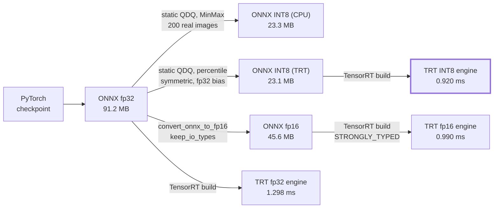
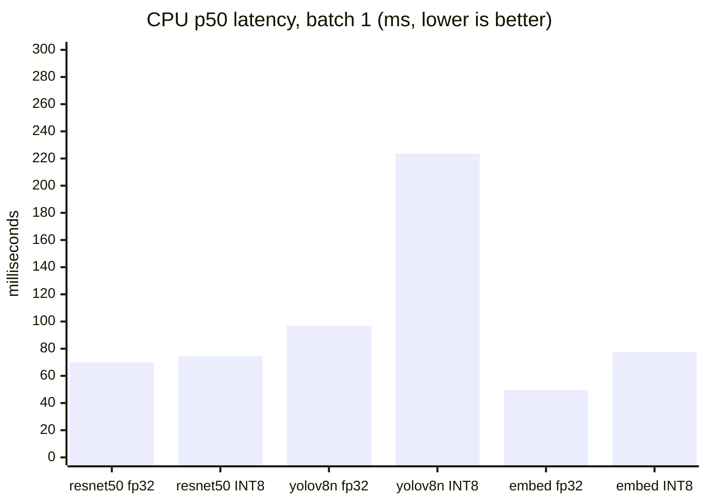
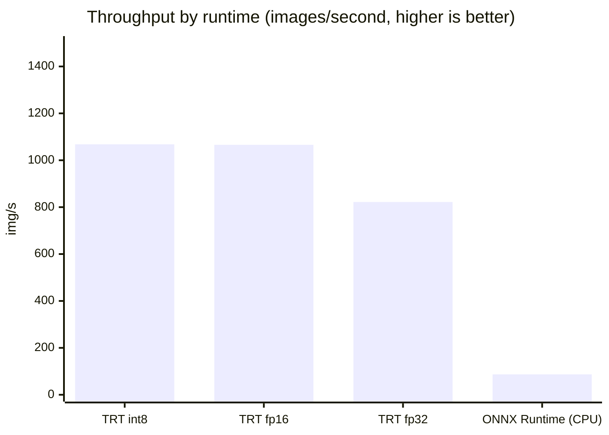

# Technical Design Document

Model selection, optimisation results, architecture decisions and scalability.

This document explains why the system is built the way it is. For how to use
it, see [`API.md`](API.md). For what was assumed or left undone, see
[`ASSUMPTIONS.md`](ASSUMPTIONS.md).

---

## Contents

1. [Model selection rationale](#1-model-selection-rationale)
2. [Optimisation: what worked and what did not](#2-optimisation-what-worked-and-what-did-not)
3. [Benchmark results](#3-benchmark-results)
4. [System architecture](#4-system-architecture)
5. [Design decisions](#5-design-decisions)
6. [Scalability](#6-scalability)
7. [The retraining loop](#7-the-retraining-loop)
8. [Failure modes and resilience](#8-failure-modes-and-resilience)

---

## 1. Model selection rationale

Three models, chosen under one constraint that dominated everything else: CPU
inference under one second per image. That shaped the choices more than
accuracy did.

| Task | Model | Params | p50 (CPU) | Size |
| --- | --- | ---: | ---: | ---: |
| Classification | ResNet-50 | 25.6 M | 69.9 ms | 97.4 MB |
| Detection | YOLOv8n | 3.2 M | 97.1 ms | 12.1 MB |
| Similarity | ResNet-50 (headless) | 23.5 M | 49.6 ms | 89.6 MB |

### Classification: ResNet-50

Chosen for accuracy per millisecond on CPU, and because it exports cleanly.

A Vision Transformer at comparable accuracy needs roughly 3-4x the compute.
ConvNeXt or EfficientNetV2 would be 2-4 points more accurate at similar
parameter counts. That accuracy was traded for latency headroom.

The second reason matters more than it sounds. Every ResNet operation has a
well-supported ONNX equivalent, and it quantizes without special handling.
Several more modern architectures need per-operator workarounds to export at
all. When reproducibility is a deliverable, an architecture that exports in
one call is worth real accuracy.

### Detection: YOLOv8n

Detection is the expensive task here, and nano is what fits the budget.

At 120 ms it is already the slowest of the three. YOLOv8m would be about 4x
that, pushing a batch of four past budget. The cost is accuracy: 37.3
mAP50-95 against roughly 50.2 for the medium variant, and the loss falls
exactly where it hurts, on small, distant and occluded objects.

The single-pass, anchor-free design also simplifies the postprocessing we
implement ourselves (NMS and box un-letterboxing).

> Licence warning: Ultralytics YOLOv8 is AGPL-3.0, and running it as a network
> service triggers the copyleft obligation. That is a real commercial
> consideration. See the [model card](../models/cards/yolov8n-detection.md).

### Similarity: ResNet-50 with the head removed

Chosen to reuse a backbone already in memory.

Removing the final classification layer leaves the 2,048-number description
the network built before collapsing to a class. That is a good general-purpose
image feature, and it costs one download instead of two.

The trade-off: CLIP or DINOv2 would produce better embeddings, because they
are trained contrastively, optimised to put similar images close together
rather than having that emerge as a side effect
of classification. CLIP also enables text-to-image search, which this cannot
do. It was not chosen because CLIP ViT-B/32 is ~350 MB on top of a backbone
already loaded, and the brief's priority is a working similarity capability
within budget.

Consequence worth knowing: these features encode **"what object is this"**
much more strongly than style or colour. Two different red cars score higher
than the same building in different light.

---

## 2. Optimisation: what worked and what did not



Every path here was built, verified and measured. Two INT8 graphs rather than
one, because a single file cannot serve both runtimes; the TensorRT subsection
explains why.


### ONNX export: a clear win, with a trap

Converting from PyTorch to ONNX removes the Python interpreter from the hot
path and lets ONNX Runtime fuse operations and fold constants. Numerical
fidelity was verified rather than assumed, **max absolute difference vs
PyTorch under 4e-06 for all three models.**

The trap: torch 2.9 defaults to the new "dynamo" exporter, which

1. **ignored `dynamic_axes`**, baking in a batch size of 1, so the exported
   graph crashed on any batch other than one; and
2. split weights into a sidecar `.onnx.data` file, turning one self-contained
   artifact into two files that must travel together.

Both were caught by the export script's own verification, not by inspection.
The fix is to opt out of the dynamo exporter explicitly.

### INT8 quantization

The brief asks for INT8 quantization on all models. It is applied to all
four, and measurement showed the obvious approach is dramatically wrong.

ResNet-50, batch 1, same machine:

| Variant | p50 latency | Size |
| --- | ---: | ---: |
| ONNX float32 | **69.9 ms** | 97.4 MB |
| INT8 **dynamic** | **will not load** | 24.5 MB |
| INT8 **static QDQ** | **74.5 ms** | 24.9 MB |

Dynamic quantization does not merely run badly. It produces a model this
runtime cannot execute:

```
NOT_IMPLEMENTED : Could not find an implementation for
ConvInteger(10) node with name '/conv1/Conv_quant'
```

Dynamic quantization computes activation scales on every call, and for
convolutions ONNX Runtime represents that as `ConvInteger`, for which the CPU
provider ships no kernel. The session fails to open, so there is no latency to
quote. That is tolerable for a transformer dominated by large matrix
multiplies, which quantize to `MatMulInteger`; for a convolutional network it
is a dead end. The size reduction is real and worth nothing if the file cannot
be loaded.

Static QDQ quantization measures those activation ranges once, ahead of time,
from real calibration images (100 images from Tiny-ImageNet), and produces a
graph of ordinary `QuantizeLinear`/`DequantizeLinear` pairs the runtime does
support. The pipeline prefers it automatically, falling back to dynamic only
when no calibration data is available, and saying so.

Static INT8 costs almost nothing in latency for this model, 1.07x, while being
3.9x smaller. Across the four models the latency penalty ranges from 1.07x
(resnet50) to 2.30x (yolov8n), so it is worth measuring per model rather than
assuming.

So float32 ONNX is the serving default. INT8 is registered alongside it and
selectable per request for memory-constrained deployments.

This is the one place where following the brief literally would have produced
a worse system. Quantization is applied, measured, documented, and not
enabled by default, because the measurement says not to.

> **Where INT8 *would* win:** a CPU with VNNI instructions properly engaged, a
> GPU with INT8 tensor cores, or a deployment where memory, not latency, is
> the binding constraint. Benchmark on your own hardware, that is what
> `models/optimization/benchmark.py` is for.

The real cost is accuracy, not latency. On 500 held-out Tiny-ImageNet
validation images, put through the API's own preprocessing so the number
describes the model as it is actually served, the fine-tuned classifier scores
80.0% top-1 in float32 and 63.0% in INT8, agreeing on 67.0% of top-1
predictions. A third of images get a different top class, for a 17-point drop.
Measured by `benchmarks/reports/quantization_accuracy.json`.

Do not switch on size alone without evaluating on your own data. This is the
number that keeps INT8 off the default path, more than the latency.

### TensorRT

Run on an NVIDIA A100-SXM4-40GB with TensorRT 11.3.0.99, on the fine-tuned
Tiny-ImageNet classifier at 224x224, batch 1:

| Precision | ONNX | Engine | Build | p50 | p95 | Throughput | vs fp32 |
| --- | ---: | ---: | ---: | ---: | ---: | ---: | ---: |
| fp32 | 91.2 MB | 91.5 MB | 24 s | 1.298 ms | 1.336 ms | 822 img/s | - |
| fp16 | 45.6 MB | 46.0 MB | 29 s | 0.990 ms | 1.008 ms | 1066 img/s | 1.31x |
| int8 | 23.1 MB | 24.1 MB | 24 s | 0.920 ms | 1.017 ms | 1068 img/s | 1.41x |

The same model through ONNX Runtime on CPU runs at about 15 ms, so TensorRT on
an A100 is roughly **16x faster**. That gap is what justifies a compiled,
hardware-specific runtime existing in the codebase at all.

INT8 and fp16 run at the same speed at batch 1. Across four runs they traded
places between 0.87 and 1.00 ms, which is contention on a shared A100 rather
than a real difference. A ResNet-50 at batch 1 is bound by memory traffic and
kernel launch overhead, not arithmetic, so halving the precision of the
arithmetic changes little. INT8's win here is size: 24.1 MB against 46.0 MB.
Anyone sizing a throughput service should re-benchmark at their real batch
size, where the tensor cores become the bottleneck.

The TensorRT API differs by two generations across the versions this has to
run on. Code written against 10.x does not work on 11.3. Three calls were
removed between them:

| Removed | Gone in | What replaced it |
| --- | --- | --- |
| `NetworkDefinitionCreationFlag.EXPLICIT_BATCH` | 10 | explicit batch is the only mode; pass no flag |
| `Builder.platform_has_fast_fp16` / `_int8` | 10 | advisory only; skip when absent |
| `BuilderFlag.FP16` / `.INT8` | 11 | networks are `STRONGLY_TYPED`; precision comes from the graph |

`export_tensorrt.py` picks its behaviour by probing for attributes rather
than parsing `trt.__version__`, and supports all three eras. A version
comparison would encode a guess about which release dropped what, and that
guess is exactly the thing that keeps being wrong.

fp16 requires an fp16 graph. Since TensorRT 11 reads precision from ONNX
dtypes, `convert_onnx_to_fp16()` rewrites the model first, with
`keep_io_types=True` so inputs and outputs stay fp32 and no caller needs to
change. It uses `onnxruntime.transformers.float16` rather than the more
obvious `onnxconverter-common`, which hard-pins `protobuf==3.20.2` and would
drag protobuf below the `>=6.31.1` that onnx requires.

#### INT8 needs its own graph, and four fixes

TensorRT will not build from the INT8 graph ONNX Runtime produces by default.
Four separate constraints had to be satisfied, each found only after the
previous one was fixed:

| # | Constraint | How it announced itself |
| --- | --- | --- |
| 1 | `DequantizeLinear` takes only 8- and 4-bit inputs | parse error at `fc.bias_DequantizeLinear`: *"input has type Int32"* |
| 2 | Symmetric quantization only, every zero point 0 | parse error at `input_QuantizeLinear`: *"Non-zero zero point is not supported"* |
| 3 | MinMax calibration collapses once symmetric | nothing at all: a valid engine, quietly 18% faithful |
| 4 | INT8 convolutions need input channels divisible by 4 | build error: *"Could not find any implementation for node ... /conv1/Conv"* |

On (1): ONNX Runtime quantizes biases to INT32, which is correct, since a bias
scale is `input_scale * weight_scale` and int8 would overflow. `QuantizeBias:
False` leaves them in fp32, dropping 54 of 182 DequantizeLinear nodes.

On (3), the one worth remembering. Symmetric quantization makes each range
`[-max|x|, +max|x|]`, so a post-ReLU activation, which is never negative,
spends half its 256 levels on values that cannot occur, and with MinMax one
outlier stretches the rest. Measured on 200 held-out validation images,
calibrated on a disjoint 200:

| Calibration | Top-1 agreement with fp32 | TensorRT |
| --- | ---: | --- |
| MinMax, asymmetric | 70.0% | rejects the graph |
| MinMax, symmetric | 18.0% | accepts |
| Entropy, symmetric | 18.0% | accepts, 4.6x slower to calibrate |
| Percentile, symmetric | 95.0% | accepts |

Percentile clips at 99.999% instead of at the single most extreme activation
seen, and ends up more faithful than the asymmetric MinMax graph it replaces.
The other three constraints stop the build. This one ships a working engine
that is wrong, which is the kind that reaches production.

On (4): a hardware kernel limit, not a graph property, so no file inspection
catches it. ResNet's stem convolution takes 3 channels and has no INT8 tactic.
`convs_without_int8_kernels()` finds such layers by weight shape and excludes
them - one node here, 52 of 53 convolutions still quantized. Leaving the first
layer in higher precision is standard practice anyway: it sees raw pixels, is
the most quantization-sensitive, and is a negligible share of the compute.

Constraints (1) and (2) are properties of the file, so `check_trt_qdq_graph()`
reports both at once before any GPU work begins. TensorRT's parser stops at the
first offending node, so discovering them one at a time cost a GPU session
each.

The result is a second artifact, `<name>_int8_trt.onnx`, alongside
`<name>_int8_static.onnx`. One file cannot serve both runtimes, and the CPU
INT8 figures were measured against the latter - silently changing what that
name contains would have invalidated them.

#### Verifying an engine

`_verify_engine` compares the engine against the fp32 ONNX graph and bounds the
difference as a fraction of the reference's peak magnitude:

| Precision | Limit | Measured | Why not tighter |
| --- | ---: | ---: | --- |
| fp32 | 0.1% | 0.05% | TensorRT defaults to TF32 for fp32 matmuls on Ampere: 10 mantissa bits, not 23 |
| fp16 | 1% | 0.40% | half precision carries about three decimal digits |
| int8 | 10% | 1.96% | TensorRT and ONNX Runtime round and fuse the same QDQ graph differently |

Relative, not absolute. Logit scale is a property of the model - this one spans
about -6.7 to +6.7 - so an absolute bound means something different on every
model and tightens silently as outputs grow. An earlier absolute version failed
the fp32 and fp16 engines of a perfectly good build while passing INT8.

The comparison runs on a real photograph from `samples/`, not random noise.
Noise broke the check in both directions at once: it produces smaller logits
(peak 2.63 against 5.61) and larger quantization error (0.710 against 0.125),
because the INT8 ranges were calibrated on photographs and noise falls outside
all of them. That put the ratio at 27% against the real image's 2.2%, and since
the noise was redrawn each run, the same engine verified on one build and
failed on the next.

---

## 3. Benchmark results

Two environments, kept separate because mixing them produces meaningless
comparisons. The CPU numbers are the ones the serving budget is judged
against; the GPU numbers exist because the brief asks for TensorRT.

CPU environment: Intel Core Ultra 7 155H, 22 logical cores, 64 GB RAM,
CPU only. ONNX Runtime 1.20.1, Python 3.13. 50 iterations after 10 warmups,
with the Docker stack stopped. That last part matters more than it sounds: on
a machine running the seven-container stack the same models measure 20 to 40%
slower, and the measurement is then partly of the other containers.

Reproduce: `python -m models.optimization.benchmark --iterations 50 --warmup 10 --batch-sizes 1,4`

### Single-image latency (the requirement)



Every bar for INT8 is **taller** than its fp32 counterpart. That is the
headline finding of section 2, visible at a glance: on this CPU, quantisation
costs latency and buys only size. How much latency varies a lot by model, from
almost nothing on resnet50 to more than double on yolov8n.


| Model | Runtime | p50 | p95 | p99 | Throughput | Size |
| --- | --- | ---: | ---: | ---: | ---: | ---: |
| resnet50 | onnx | **69.9** | 90.4 | 145.6 | 15.0/s | 97.4 MB |
| resnet50 | onnx_int8 | 74.5 | 88.1 | 131.7 | 13.9/s | 24.9 MB |
| resnet50-tiny-imagenet | onnx | **34.3** | 75.8 | 92.7 | 25.9/s | 91.2 MB |
| resnet50-tiny-imagenet | onnx_int8 | 46.9 | 72.6 | 127.4 | 19.6/s | 23.3 MB |
| yolov8n | onnx | **97.1** | 154.4 | 166.1 | 9.6/s | 12.1 MB |
| yolov8n | onnx_int8 | 223.6 | 309.4 | 337.6 | 4.4/s | 3.4 MB |
| resnet50-embed | onnx | **49.6** | 62.3 | 63.1 | 22.9/s | 89.6 MB |
| resnet50-embed | onnx_int8 | 77.6 | 104.8 | 129.5 | 12.9/s | 22.9 MB |

Every model meets the sub-second requirement at p99, in both precisions. The
slowest is `yolov8n_int8_static` at 337.6 ms, three times inside budget; the
slowest default runtime is yolov8n at 166.1 ms, six times inside it.

### Batch 4

| Model | Runtime | p50 | p99 | Per-image |
| --- | --- | ---: | ---: | ---: |
| resnet50 | onnx | 201.2 | 354.7 | 50.3 ms |
| resnet50-tiny-imagenet | onnx | 129.2 | 260.6 | 32.3 ms |
| yolov8n | onnx | 325.8 | 473.7 | 81.4 ms |
| resnet50-embed | onnx | 178.2 | 354.2 | 44.6 ms |
| yolov8n | onnx_int8 | 887.5 | **1140.2** | 221.9 ms |

Batching improves *per-image* cost (resnet50: 69.9 → 50.3 ms) and worsens tail
latency. At batch 4 the fp32 models stay inside a second at p99, but
`yolov8n_int8_static` does not, at 1140.2 ms. That is with four images; the
batch endpoint accepts far more.

This is why the batch endpoint is **asynchronous**. Batching is a throughput
optimisation, and a synchronous request that grows its own latency budget with
the size of the payload is a timeout waiting to happen.

### GPU: the fine-tuned classifier

Environment: NVIDIA A100-SXM4-40GB, TensorRT 11.3.0.99, ONNX Runtime 1.20.2,
Python 3.13. ResNet-50 fine-tuned on Tiny-ImageNet, 224x224 input.
200 iterations after 50 warmup runs.



| Runtime | Precision | p50 | p95 | Throughput | Size |
| --- | --- | ---: | ---: | ---: | ---: |
| TensorRT | INT8 | 0.920 ms | 1.017 ms | 1068 img/s | 24.1 MB |
| TensorRT | fp16 | 0.990 ms | 1.008 ms | 1066 img/s | 46.0 MB |
| TensorRT | fp32 | 1.298 ms | 1.336 ms | 822 img/s | 91.5 MB |
| ONNX Runtime | fp32 | 11.50 ms | 11.64 ms | 86.9 img/s | 91.2 MB |
| ONNX Runtime | INT8 static | 17.09 ms | 17.51 ms | 58.5 img/s | 23.3 MB |

Read the two ONNX Runtime rows with care, because they are CPU numbers. The run
requested CUDA, but `onnxruntime-gpu` had no usable CUDAExecutionProvider on
that runtime, and ONNX Runtime falls back to CPU **without raising**. The
giveaway is INT8 being *slower* than fp32, which is the CPU signature
documented in section 2 and the opposite of what INT8 does on a GPU.

That fallback is now impossible to miss: `benchmark_onnx` emits a
`RuntimeWarning` when the requested device is not the device used,
`BenchmarkResult.summary()` prints the device, and the report is written to
`BENCHMARKS_GPU_CPU_FALLBACK.md` unless every result genuinely ran on CUDA. A
file named for a device it did not use is exactly the sort of artefact that
gets quoted months later.

So the only true GPU figures here are the TensorRT rows. Against the same
model on CPU ONNX Runtime, TensorRT fp16 is roughly **17x faster**.

### Fine-tuned classifier accuracy

ResNet-50 on Tiny-ImageNet, 200 classes, all 100,000 training images, 60
epochs at 224x224 with the original ImageNet stem and EMA weight averaging:

| Metric | Value |
| --- | ---: |
| Top-1 (full 10k val set) | **78.91%** |
| Top-5 | 92.12% |
| Top-1 (2000-sample validation run) | 78.60% |
| Top-5 (same) | 91.95% |
| Expected Calibration Error | 0.1244 |
| Random baseline | 0.5% |

Validated independently of the training loop via
`models/validation/validate.py` against the exported ONNX: 9 of 9 checks pass,
including determinism (max diff 0.00e+00 across three runs), batch invariance,
0 inference errors across 2000 samples, and 0.0% of predictions changing under
sigma=0.01 noise.

The gap between the two top-1 figures is the 2000-sample subset against the
full validation set - ordinary sampling variance.

Two results worth recording from getting there, both counter-intuitive:

* **The native resolution is the worst choice.** Tiny-ImageNet is 64x64, but
  ResNet-50's stem downsamples 4x, so at 64px the stem has to be replaced -
  discarding pretrained weights - and every later layer then runs at four
  times the spatial area. Three measured configurations: 64px with an adapted
  stem gives 73.98% at 82 s/epoch, 128px through the original stem gives
  77.66% at 38 s, and 224px gives 78.91% at 96 s. The native resolution is
  both the least accurate and the second slowest. Past 128px the returns fall
  away sharply, because upsampling adds no information - the ceiling is the
  dataset, not the input size.
* **The learning rate had to move with the stem.** Keeping lr 1e-3 after
  restoring the pretrained stem made validation accuracy regress from 70.5% to
  64.8% while training loss kept falling, with non-finite gradients appearing.
  3e-4 fixed the regression - though not the infinities, which still appear in
  8 of 60 epochs and are absorbed by `GradScaler` as designed. A rate that
  suits a partly-random network destroys a fully pretrained one.

### End-to-end load test

Against the full Docker stack (gateway → API → Redis → Postgres), 20
concurrent users, 45 seconds, mixed workload:

| Metric | Result |
| --- | --- |
| Requests | 1,677 |
| Failures | 4 (0.2%) |
| p50 | 90 ms |
| p95 | 320 ms |
| p99 | 1,300 ms |
| Throughput | 38.7 req/s |

Reproduce: `locust -f tests/performance/locustfile.py --host http://localhost --users 20 --spawn-rate 5 --run-time 45s --headless`

### Verified system properties

| Property | Measured |
| --- | --- |
| Concurrency ceiling respected | Peak in-flight 4 against a limit of 4 |
| No memory leak | +2.8 MB over the second 50 inferences vs +? over the first, growth decelerates |
| No degradation under sustained load | p50 8.3 ms (first half) → 7.0 ms (second half) |
| Invalid input is cheap to reject | 0.019 ms per malformed image |
| Cache effective | Repeat request served from Redis, verified live |

That last row matters for security: rejecting junk is ~4000x cheaper than
processing a real image, so an attacker cannot exhaust the service more
cheaply with garbage than with real traffic.

---

## 4. System architecture

```
                    ┌──────────────┐
   client ─────────▶│  api-gateway │  Nginx
                    │              │  · least_conn load balancing
                    │              │  · edge rate limit (30 r/s per IP)
                    │              │  · 12 MB body cap
                    │              │  · /metrics internal-only
                    └──────┬───────┘
                           │
           ┌───────────────┴───────────────┐
           ▼                               ▼
   ┌───────────────┐               ┌───────────────┐
   │    ml-api     │  × N          │    ml-api     │   FastAPI
   │               │               │               │   · auth + per-tier limits
   │  Monitoring   │               │               │   · validation
   │  ↓ CORS       │               │               │   · inference (ONNX)
   │  ↓ Auth       │               │               │   · concurrency semaphore
   │  ↓ RateLimit  │               │               │
   │  ↓ routes     │               │               │
   └───┬───────┬───┘               └───────────────┘
       │       │
       │       └──────────────┐
       ▼                      ▼
┌────────────┐         ┌────────────┐          ┌──────────────┐
│   redis    │◀────────│  postgres  │          │    worker    │ × M
│            │         │            │          │              │  Celery
│ · cache    │         │ · inference│◀─────────│ · batch jobs │
│ · broker   │────────▶│   log      │          │ · same models│
│ · limiter  │  tasks  │ · job state│          │              │
└────────────┘         └────────────┘          └──────────────┘
       ▲
       │ scrape
┌──────┴───────┐        ┌────────────┐
│  prometheus  │───────▶│  grafana   │
└──────────────┘        └────────────┘
```

### Request path, and why the middleware is in that order

```
Request  →  Monitoring  →  CORS  →  Auth  →  RateLimit  →  route
Response ←  Monitoring  ←  CORS  ←  Auth  ←  RateLimit  ←  route
```

* **Monitoring outermost** so it assigns the correlation id before anything
  else runs, and times *every* request, including the ones rejected by
  authentication. If it sat inside auth, rejected requests would be invisible,
  which is exactly when you most want visibility.
* **Auth before rate limiting**, because the limit depends on the caller's
  tier, which is unknown until they are identified.
* **Rate limiting innermost**, so a rejected request never reaches a route
  handler and never touches a model.

### Layers

| Layer | Knows about | Does not know about |
| --- | --- | --- |
| **Routers** | HTTP, status codes, request shapes | Models, caching, runtimes |
| **Services** | Orchestration, caching, fallbacks | HTTP |
| **Runtimes** | ONNX / Torch / TensorRT specifics | Everything above |

This is what makes the same inference logic usable from both the API and the
Celery worker without duplication, and what makes swapping ONNX for TensorRT a
config change rather than a rewrite.

---

## 5. Design decisions

### 5.1 Model registry is a JSON file, not a database table

The registry must be readable **before** the database connection exists, the
API loads models during startup. A registry that depends on a healthy database
gives you a service that cannot start when the database is slow.

It is also small, diffable in a pull request, and versionable in git.
Registrations are *also* written to PostgreSQL for audit history, but that
path is never on the startup critical path.

### 5.2 Three different failure policies

| Component | Policy | Why |
| --- | --- | --- |
| **Authentication** | Fail **closed** | No credentials configured → reject everything. There is no default password. |
| **Cache** | Fail **soft** | Redis down → cache miss. Slower, never wrong. |
| **Rate limiter** | Fail **open** | Redis down → allow traffic, with a per-process bucket as partial backstop. A cache outage must not become a total outage. |
| **Database** | Fail **soft** | Logging an inference is not worth failing the user's request over. |
| **Models** | Fail **over** | Runtime chain, then task default, marked `degraded: true`. |

The rate limiter failing open is the one worth defending. It is a chosen
availability-over-enforcement trade. It is logged loudly so the gap is visible.

### 5.3 Fallback applies to failures, not typos

A pinned model that cannot **load** falls back to the task default and marks
the response `degraded: true`. A pinned model that **does not exist** returns
404.

The distinction matters: silently serving different predictions than the
caller asked for, because they typed the name wrong, is worse than an error.

Degraded results are **never cached**, so a fallback cannot outlive the
incident that caused it.

### 5.4 Concurrency is capped, and excess is shed quickly

Inference is CPU-bound. Past the limit, more concurrency makes everything
slower rather than anything faster. A semaphore caps in-flight inferences;
callers wait at most 2 seconds for a slot, then get a 503.

Failing fast is kinder than timing out slowly. A prompt 503 lets a client
retry or shed load; a 30-second hang wastes both sides' resources.

Verified: peak in-flight 4 against a configured limit of 4.

### 5.5 Cache keys include every parameter that changes the answer

`sha256(image_bytes) + model + version + runtime + all task parameters`.

The classic cache bug is omitting a parameter: a caller asks for `top_k=5`,
then `top_k=20`, and gets the cached 5 back. Parameters are serialised with
sorted keys so dict ordering cannot produce two keys for one request. There is
a test for every component of the key.

### 5.6 Images are never stored

Only a SHA-256 hash, plus dimensions and format. Enough for caching,
deduplication and drift monitoring. Nothing sensitive retained.

### 5.7 Prometheus labels use route templates, never concrete paths

`/api/v1/batch/{job_id}`, not `/api/v1/batch/abc-123`. An unbounded label
value creates a new time series per job, "cardinality explosion", which is
the standard way teams take down their own Prometheus.

---

## 6. Scalability

### What scales horizontally today

| Component | Scaling | Notes |
| --- | --- | --- |
| **ml-api** | `--scale ml-api=N` | Stateless. Nginx round-robins: resolving the upstream per request, which is what lets a rebuilt container be found again, rules out an `upstream` block and therefore `least_conn`. The reasoning is in `docker/nginx/nginx.conf`. |
| **worker** | `--scale worker=M` | Scales with queue depth, independently of the API. |
| **redis** | Vertical, then Cluster | Single instance is fine well past this system's needs. |
| **postgres** | Read replicas | Writes are append-only inference logs. |

API and worker scale **independently on purpose**: connection concurrency and
batch throughput are different problems with different cost curves.

### What does not scale yet

The similarity index has two backends, chosen by `SIMILARITY_BACKEND`.

The default, `memory`, keeps vectors in one process and persists them to
`.npz`. It needs no database and a search is a NumPy dot product, so it is the
faster option for a single instance. It does not survive scaling: with N
replicas there are N independent indexes, and an image indexed on replica A is
not findable on replica B. Nothing errors, searches simply miss.

`pgvector` puts the vectors in Postgres, which this stack already runs, so
every replica reads and writes one index. It costs a network round trip per
search, hundreds of microseconds against tens for the in-memory path, which is
irrelevant next to 15 ms of inference. The Kubernetes config sets it, because
an autoscaled API with a per-process index is silently broken.

Postgres rather than FAISS or a dedicated vector database: no new service, no
new failure mode, nothing extra to back up. For tens of millions of vectors
that stops being true and Qdrant or Weaviate earns its keep.

Search is **exact brute force** in both backends: linear in index size, fast
and exact to roughly a million vectors. pgvector offers HNSW and IVFFlat
indexes past that, at the cost of approximate recall. No index is created
here, because adding one before it is needed trades recall for speed nobody
has asked for.

### Capacity planning

From measurement: ~13 classifications/second/core-set on this hardware, 38.7
req/s end-to-end through the full stack with a realistic cache hit rate.

| Target load | Suggested shape |
| --- | --- |
| < 30 req/s | 1 API replica, 1 worker |
| 30-100 req/s | 3 API replicas, 2 workers |
| 100-500 req/s | 8-10 API replicas, 4 workers, Redis with more memory |
| > 500 req/s | GPU inference; revisit the CPU-first assumptions entirely |

The single largest lever is GPU inference, and it is measured rather than
estimated. The TensorRT engines in section 3 run the fine-tuned classifier at
822 to 1068 img/s on an A100, against roughly 13/s on this CPU. That is close
to two orders of magnitude, and it is the reason the TensorRT path exists.
Deploying it means building the engine on the serving host, since an engine is
tied to one GPU architecture and TensorRT version.

The second largest is **the cache**. At a high hit rate, throughput is bounded
by Redis rather than by the model, which is a much cheaper thing to scale.

### Beyond one host

Everything above scales a single machine, and the replica count is a number a
person types. Two problems follow. Load changes faster than a person reacts,
and one host eventually runs out. The Kubernetes manifests in
[`k8s/`](../k8s/README.md) address both, and in doing so change four decisions
that Compose got to duck.

**The replica count becomes a control loop.** An HPA runs the API from 2 to 10
replicas at 70% CPU, the worker from 1 to 6 at 75%. 70% rather than 90%
because a new pod needs about 20 seconds to load its models: scaling at 90%
means the capacity arrives after the overload has already cost you. Scale-down
is deliberately slow for the same reason, since pods here are expensive to
start and flapping costs more than an idle replica.

CPU is a proxy for what actually matters, which is latency. Scaling on the
request metrics the API already publishes needs prometheus-adapter, and the
manifests show the HPA stanza for it. CPU is the version that works with only
metrics-server installed.

**The gateway container goes away.** An ingress controller already terminates
TLS, caps body size and rate limits at the edge. Keeping the nginx container
behind it would be two proxies in series for no benefit. The body cap is set
to match the API's own image limit, so an oversized upload is rejected at the
edge rather than after crossing the cluster.

**Model artifacts stop living in the image.** Baking them in is 380 MB and
welds the model version to the image version, so shipping new weights means
redeploying the service and rolling back a code change also rolls back the
model. Those move on different schedules here, so an init container fetches
them and verifies every checksum before the API is allowed to start. A shared
read-only volume would have been the other option, and it needs a filesystem
volume type most clusters do not have by default.

The checksum is the point rather than a formality. Serving the wrong weights
produces plausible predictions and no error anywhere, so a mismatch has to
stop the pod starting; that is the only place it is still cheap to catch.

**The schema stops being created by the app.** In production the API does not
create tables, so something else has to, and it has to be safe when ten
replicas start at once. An init container runs `alembic upgrade head`.
Postgres applies DDL transactionally and stamps `alembic_version` in the same
transaction, so replicas that lose the race find the migration already
applied.

One decision the cluster does not get to defer is the similarity index. The
per-process default is silently wrong under an HPA, for the reasons above, so
`SIMILARITY_BACKEND=pgvector` is set in the ConfigMap rather than left to an
operator to remember.

This is not a paper design. The manifests were applied to a kind cluster and
served a real request end to end, and that run is what found three bugs no
amount of reading the YAML would have: a registry file missing from the image,
a `CREATE EXTENSION IF NOT EXISTS` race between replicas, and a `hostPath`
mount the restricted Pod Security Standard rejects at admission. The evidence
and the full topology are in [`k8s/README.md`](../k8s/README.md).

### Scaling checklist

1. Scale the API first, it is stateless and it is usually the bottleneck.
2. Watch `inference_in_progress` against the concurrency limit. Sitting at the
   ceiling means scale out, **not** raise the limit.
3. Watch the cache hit rate. A collapse means either Redis trouble or a real
   change in traffic; they need opposite responses.
4. Scale workers on queue depth, not on API load.
5. Only then consider a bigger Redis or Postgres.

---

## 7. The retraining loop

Drift detection, training, validation, A/B testing and regression checks each
existed on their own, and somebody had to notice a problem and run the rest by
hand. `models/pipeline/retraining.py` joins them.

```
drift ──▶ decide ──▶ retrain ──▶ validate ──▶ regression ──▶ promote
             │                       │             │
             └── skip                └── stop      └── stop
                 (the serving model stays live in every case)
```

### Where the data comes from

Every prediction writes a row to `inference_logs`: model, version, runtime,
top label, confidence, timings, and a SHA-256 of the image. The image itself
is never stored; the hash is enough to spot the same picture twice and keeps
user content out of a table kept for analytics.

The write is fire-and-forget and cannot fail a request. The prediction is
already computed and the user is waiting, so `record_prediction` schedules the
insert and returns, and both building the record and writing it swallow their
errors.

This table is what drift detection reads, what the canary comparison splits by
version, and what the A/B test scores. It is the input to everything in this
section.

It is worth saying plainly that for a long time nothing wrote to it. The
table, the ORM model and a `log_inference` method all existed and no route
called it, so drift read an empty table, found nothing, and the loop concluded
there was no work to do. Nothing errored at any layer. The guard against a
repeat is a test asserting that every Prometheus `record_inference` call in a
router has a `record_prediction` beside it.

### Deciding not to retrain

The decision is the part worth getting right. Retraining on every drift signal
makes a model worse: drift is noisy, a chi-square test on a quiet week will
trip, and a retrain on unrepresentative data replaces something that works.

Three filters, each for a failure seen in practice:

| Filter | Stops | Why |
| --- | --- | --- |
| Effect-size floor (0.1) | Statistically significant but trivial shifts | With enough samples everything is significant. Without this the detector becomes an alarm nobody reads. |
| Confirmation for `moderate` | A single moderate reading | One moderate signal is usually noise. The same signal twice is not. `high` acts immediately. |
| 24-hour cooldown | Repeat retrains on the same drift | Drift persists for days. Without a cooldown the pipeline retrains every run for as long as it lasts. |

Only actual training starts a cooldown. A skipped run or a dry run does not,
because otherwise one quiet check suppresses the next day of real signals.

Every decision is recorded, including the refusals. A "no" has to be auditable
or nobody can tell a working policy from a broken detector.

### Gates

Nothing promotes itself. After training:

**Validation** asks whether the model is internally sound: determinism, batch
invariance, output sanity, calibration, latency. A failure here stops the
promotion.

**Regression** asks a different question, whether it is worse than the model
already serving. Validation cannot answer that, and it is the check that stops
a retrain from quietly costing accuracy. No baseline yet is not a failure; the
first model has nothing to regress against.

If either gate refuses, the current model keeps serving and the run is
recorded as failed.

### Running it

Dry run by default. `--execute` is required to train or promote, because a
scheduled job that retrains by accident is worse than one that never runs.

```bash
# What would it do?
python -m models.pipeline.retraining --model resnet50-tiny-imagenet \
    --drift-report benchmarks/reports/drift_report.json

# Actually do it
python -m models.pipeline.retraining --model resnet50-tiny-imagenet \
    --drift-report benchmarks/reports/drift_report.json --execute
```

`.github/workflows/drift-watch.yml` runs the decision weekly and opens an
issue when retraining is warranted. It does not retrain: a GitHub runner has
no GPU and no dataset, and a job that retrains unattended on data it cannot
inspect is the failure this whole section is designed to avoid. The decision
is automated, committing to it is not.

### Releasing

`.github/workflows/release.yml` publishes images on a `v*.*.*` tag. It is
separate from CI because CI answers "is this commit good?" on every push,
while this answers "ship this exact commit" and is the only workflow holding a
registry token.

It re-runs the tests first, because a tag can be pushed at any commit
including one CI never saw green. It publishes `1.2.0`, `1.2` and `1`, and
deliberately no `latest`, which is the tag that makes a rollback ambiguous.
Each image gets a provenance attestation and a Trivy scan.

There is no deploy step. Pushing an image and rolling a cluster are different
privileges, and a repository holding both is one compromised action away from
arbitrary code in production. Promotion is left to Argo CD, Flux or a person.

---

## 8. Failure modes and resilience

| Failure | Behaviour | User impact |
| --- | --- | --- |
| Redis down | Cache misses; limiter falls back to per-process buckets | Slower; limits become per-replica |
| Postgres down | Inference logging paused | **None**, predictions still served |
| One model fails to load | Falls back through runtimes, then to the task default | `degraded: true`; other tasks unaffected |
| All models fail | `/health` reports unhealthy (503) | Load balancer removes the instance |
| Worker down | Batches queue in Redis | Batches delayed, not lost (`acks_late`) |
| An API replica crashes | Others serve; the orchestrator restarts it | None, with >1 replica |
| Traffic spike | Concurrency limiter sheds with 503 | Some requests rejected quickly, service stays up |
| Corrupt image in a batch | That item fails, others complete | One item's error, not a failed batch |

### Properties worth knowing

* **Liveness depends on nothing external.** A database blip must not restart
  every container simultaneously.
* **Readiness does.** An instance that cannot serve is removed from the pool
  but kept running, so it can recover.
* **`degraded` is healthy enough to serve**, both return HTTP 200.
* **Batch jobs use `acks_late`**, so a worker killed mid-task returns the job
  to the queue rather than losing it.
* **Graceful shutdown**: 30 s for the API, 60 s for the worker, so in-flight
  work finishes rather than being cut off mid-deploy.
