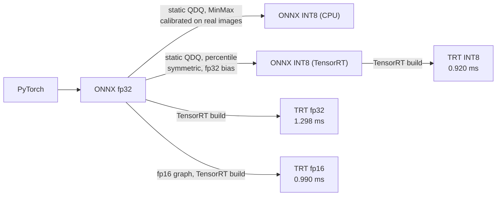

# Technical Design

Why the system is built the way it is: model choices, what optimisation did
and did not buy, how it was measured, the architecture, and how it scales.
Usage is in [API.md](API.md), operations in [DEPLOYMENT.md](DEPLOYMENT.md).

1. [Model selection](#1-model-selection)
2. [Optimisation](#2-optimisation)
3. [Benchmarks](#3-benchmarks)
4. [Architecture](#4-architecture)
5. [Design decisions](#5-design-decisions)
6. [Scalability](#6-scalability)
7. [Validation and the retraining loop](#7-validation-and-the-retraining-loop)
8. [Failure modes](#8-failure-modes)

---

## 1. Model selection

One constraint shaped every choice: under a second per image on a CPU. That
mattered more than squeezing out accuracy.

| Task | Model | Params | CPU p50 | Size |
| --- | --- | ---: | ---: | ---: |
| Classification | ResNet-50, ImageNet-1k | 25.6 M | 77.9 ms | 97.4 MB |
| Classification | ResNet-50 fine-tuned on Tiny-ImageNet | 23.9 M | 66.6 ms | 91.2 MB |
| Detection | YOLOv8n | 3.2 M | 97.0 ms | 12.1 MB |
| Similarity | ResNet-50 without its head | 23.5 M | 65.7 ms | 89.6 MB |

**ResNet-50** gives good accuracy per millisecond on CPU and exports cleanly:
every operation has a well-supported ONNX equivalent and it quantizes without
special handling. A ViT of similar accuracy costs three to four times the
compute; ConvNeXt or EfficientNetV2 would add two to four points. That
accuracy was traded for headroom and a reproducible export.

**YOLOv8n** is the smallest YOLOv8 and still the slowest model here. It is
single-pass and anchor-free, which keeps the postprocessing we write ourselves
(NMS, un-letterboxing) simple, and it exports in one call. YOLOv8m would add
about 13 mAP points for 9x the compute. Ultralytics' licence is AGPL-3.0, a
real consideration for commercial use.

**Similarity** reuses the ResNet-50 backbone with the classification layer
removed, so a third task costs no new download. CLIP or DINOv2 would retrieve
better, and CLIP would add text search, at about 350 MB more. The features
this model produces group images by what the object is, not by style.

---

## 2. Optimisation



### ONNX export

Export removes Python from the hot path and lets ONNX Runtime fuse and fold.
Every model is checked against PyTorch on real images, because a valid graph
that computes the wrong thing is worse than a failed export
(`benchmarks/reports/onnx_export.json`):

| Model | Max abs diff vs PyTorch |
| --- | ---: |
| resnet50 | 2.86e-06 |
| resnet50-tiny-imagenet | 3.81e-06 |
| resnet50-embed | ⟦EMBED_PARITY⟧ |
| yolov8n | ⟦YOLO_PARITY⟧ |

torch 2.9's default "dynamo" exporter ignored `dynamic_axes`, baking in batch
size 1, and split weights into a sidecar file. The export script's own
verification caught both; it now opts out of dynamo.

### INT8 on CPU

INT8 is applied to all four models. It is the default for none, and the
reasons are measured, not assumed.

**Dynamic quantization** ⟦DYNAMIC_SENTENCE⟧ The cause is narrower than the
error suggests: `DynamicQuantizeLinear` emits uint8 by the ONNX spec,
`quantize_dynamic` defaults to int8 weights, and ONNX Runtime only registers
`ConvInteger` for uint8 with uint8. Even with `QUInt8` weights, static is the
better choice: dynamic derives activation scales from each call's own tensor,
so a result can depend on what it was batched with.

**Static QDQ** calibrates once on real images with the model's own serving
preprocessing. Results against fp32:

| Model | Size | p50 change, batch 1 | Quality |
| --- | ---: | ---: | --- |
| resnet50 | 3.92x smaller | 0.99x (level) | ⟦R50_INT8_AGREE⟧ top-1 agreement over ⟦R50_INT8_N⟧ images |
| resnet50-tiny-imagenet | 3.91x smaller | 1.15x slower | ⟦AB_SHORT⟧ on all 10,000 validation images |
| yolov8n | 3.67x smaller | 1.83x slower | 0.381 against 0.392 mAP50-95 on 500 COCO images |
| resnet50-embed | 3.91x smaller | 1.19x slower | ⟦EMBED_INT8_COS⟧ mean cosine to fp32 |

This CPU has no fast INT8 path for these graphs, so INT8 buys size, not speed.
The fine-tuned classifier also loses real accuracy, and the paired A/B test
(section 7) says so with a p-value rather than a hunch. INT8 stays registered
and selectable per request for deployments where memory is the constraint.

**The detector's first INT8 model found nothing.** YOLOv8's head concatenates
box coordinates (0 to 640) and class scores (0 to 1) into one tensor.
Quantizing that Concat gives both one int8 scale, about 2.5 per step, and every
class score rounds to zero. Nothing flagged it: the quantizer computed top-1
agreement only for 2-D classifier outputs and reported 100% for anything else,
and it scored agreement on its own calibration images. Three fixes followed:

1. `quantize_onnx_static(op_types_to_quantize=["Conv"])` leaves the decode
   head in fp32. The detector now gets 0.381 mAP50-95 against fp32's 0.392.
2. Calibration uses each model's registered preprocessing. The detector had
   been calibrated on ImageNet-normalised centre crops instead of 0-1
   letterboxed frames, and on 64px Tiny-ImageNet thumbnails instead of COCO.
3. The quantizer now compares detector outputs by dominant class, on held-out
   images, and `tests/integration/test_quantized_fidelity.py` runs every INT8
   model beside its fp32 twin in CI, in a mode where missing artifacts fail
   rather than skip.

### TensorRT

The fine-tuned classifier on an A100-SXM4-40GB, TensorRT 11.3.0.99, batch 1
(`benchmarks/reports/tensorrt.json`):

| Precision | Engine | Build | p50 | p95 | Throughput | Max abs diff vs ONNX |
| --- | ---: | ---: | ---: | ---: | ---: | ---: |
| fp32 | 91.5 MB | 24 s | 1.298 ms | 1.336 ms | 822 img/s | 2.62e-03 |
| fp16 | 46.0 MB | 29 s | 0.990 ms | 1.008 ms | 1066 img/s | 2.19e-02 |
| INT8 | 24.1 MB | 24 s | 0.920 ms | 1.017 ms | 1068 img/s | 1.10e-01 |

INT8 is 1.41x faster than fp32 and a quarter of its size, and level with
fp16. At batch 1 a ResNet-50 on an A100 is bound by memory traffic and kernel
launches, not arithmetic, so lower precision arithmetic helps little; larger
batches are where INT8 should pull ahead. Against the same model on the laptop
CPU (15.2 img/s), the A100 serves 54 to 70 times the throughput.

The TensorRT API changed across the versions this had to run on:
`EXPLICIT_BATCH` and `platform_has_fast_fp16` went in 10, `BuilderFlag.FP16`
and `INT8` in 11, where networks are strongly typed and precision comes from
the graph. `export_tensorrt.py` probes for attributes instead of parsing
version strings. fp16 therefore needs an fp16 graph, made with
`onnxruntime.transformers.float16` (`onnxconverter-common` would pin protobuf
below what onnx requires).

TensorRT will not build ONNX Runtime's default INT8 graph. Four constraints,
each found only after the previous one was fixed:

| # | Constraint | Symptom | Fix |
| --- | --- | --- | --- |
| 1 | `DequantizeLinear` takes only 8- and 4-bit inputs | parse error at the first INT32 bias | `QuantizeBias: False` |
| 2 | Symmetric quantization only | "Non-zero zero point is not supported" | `ActivationSymmetric`, `WeightSymmetric` |
| 3 | MinMax collapses once symmetric | none: a valid, useless engine | percentile calibration |
| 4 | INT8 convolutions need input channels divisible by 4 | build error on the 3-channel stem | leave that one conv in fp32 |

Constraint 3 is the dangerous one, because it ships. Symmetric ranges are
`[-max|x|, +max|x|]`, so a post-ReLU activation wastes half its levels and one
outlier stretches the rest. Measured on the fine-tuned classifier, calibrated
on 200 validation images and scored on a disjoint 200
(`benchmarks/reports/int8_calibration.json`, `scripts/compare_int8_calibration.py`):

⟦CALIB_TABLE⟧

`check_trt_qdq_graph()` now reports constraints 1 and 2 together before any
GPU time is spent, since the parser stops at the first offending node. The
TensorRT graph is a separate file, `<name>_int8_trt.onnx`, so the CPU INT8
figures keep describing the file they were measured on. Engines are not
committed: each is tied to one GPU architecture and TensorRT version.

---

## 3. Benchmarks

### Method

CPU numbers come from an Intel Core Ultra 7 155H laptop (22 logical cores,
ONNX Runtime 1.20.1, Python 3.13) with the Docker stack stopped. This is a
hybrid CPU, and a first run that timed each model in one block measured two
ResNet-50s that differ only in their final layer at 36 and 61 ms p50: whichever
ran during a slow thermal or scheduling phase looked slow.
`models/optimization/benchmark.py` now interleaves: 20 warmup runs, then 100
timed runs per case spread over five rounds that cycle through every model and
batch size, so each case samples the same machine conditions. Tails are still
wide on a laptop, but they are now wide fairly.

```bash
python -m models.optimization.benchmark --iterations 100 --warmup 20 --rounds 5 --batch-sizes 1,4
```

### Latency

| Model | Runtime | Batch 1 p50 | p95 | p99 | Batch 4 p50 | Per image at batch 4 |
| --- | --- | ---: | ---: | ---: | ---: | ---: |
| resnet50 | fp32 | 77.9 | 184.8 | 222.6 | 204.6 | 53.0 |
| resnet50 | INT8 | 77.1 | 172.9 | 309.6 | 338.8 | 83.1 |
| resnet50-tiny-imagenet | fp32 | 66.6 | 139.0 | 176.6 | 207.5 | 53.5 |
| resnet50-tiny-imagenet | INT8 | 76.8 | 156.5 | 268.9 | 340.7 | 88.7 |
| yolov8n | fp32 | 97.0 | 200.8 | 258.2 | 319.0 | 82.8 |
| yolov8n | INT8 | 177.4 | 278.1 | 342.8 | 761.6 | 202.3 |
| resnet50-embed | fp32 | 65.7 | 128.8 | 211.2 | 198.5 | 51.8 |
| resnet50-embed | INT8 | 78.5 | 164.9 | 255.0 | 360.7 | 87.6 |

All in milliseconds. Every model meets the sub-second requirement at p99 for
one image, in both precisions. Batching lowers the per-image cost of the fp32
models by 18% to 37% and raises tail latency: INT8 YOLO at batch 4
reaches 1.34 s at p99. That is why the batch endpoint is asynchronous.
`BENCHMARKS.md` also lists `resnet50-tiny-imagenet_int8_trt`, the TensorRT
graph, run on CPU for completeness; it is slow there by design.

### Through the stack

⟦LOADTEST_TECH⟧

### System properties

From `tests/performance/test_performance.py`, output saved in
⟦PERF_REPORT_FILE⟧:

| Property | Measured |
| --- | --- |
⟦PERF_ROWS⟧

---

## 4. Architecture

```text
            ┌──────────────┐
client ────▶│ api-gateway  │  nginx: round-robin, 30 r/s per IP on inference,
            └──────┬───────┘  12 MB body cap, /metrics internal only
                   ▼
            ┌──────────────┐
            │ ml-api × N   │  FastAPI: auth, per-tier limits, validation,
            └──┬───┬───┬───┘  ONNX inference behind a concurrency limit
               │   │   │
      ┌────────┘   │   └──────────┐
      ▼            ▼              ▼
  ┌───────┐  ┌──────────┐   ┌────────────┐
  │ redis │  │ postgres │◀──│ worker × M │  Celery batch jobs
  └───────┘  └──────────┘   └────────────┘
  cache,     inference log,
  broker,    batch jobs,
  limiter    pgvector index
      ▲
      │ scrapes every API replica and worker
  ┌────────────┐     ┌─────────┐
  │ prometheus │────▶│ grafana │  18 panels, 11 alert rules
  └────────────┘     └─────────┘
```

Request path: Monitoring → CORS → Auth → RateLimit → route. Monitoring is
outermost so it assigns the correlation id and times everything, including
requests auth rejects, which is when visibility matters. Auth comes before
rate limiting because the limit depends on the caller's tier. Rate limiting is
innermost, so a rejected request never touches a model.

Routers know HTTP; services know orchestration, caching and fallbacks and
nothing about HTTP; runtimes know ONNX Runtime or TensorRT and nothing above.
That is what lets the Celery worker reuse the same inference code, and what
makes switching runtime a registry change.

---

## 5. Design decisions

**The registry is a JSON file.** The API loads models at startup, before the
database may be reachable. A registry in Postgres would mean the service
cannot start while the database is slow. The file is also diffable and
versioned with the code.

**Failure policy is chosen per component.**

| Component | Policy | Why |
| --- | --- | --- |
| Authentication | Fails closed | No keys configured means every request is rejected; there is no default credential |
| Cache | Fails soft | Redis down is a cache miss: slower, never wrong |
| Rate limiter | Fails open | Redis down falls back to per-process buckets and reconnects in the background every 10 s. A cache outage must not become a full outage |
| Inference log | Fails soft | Logging must never fail a prediction the user is waiting for |
| Models | Fails over | Through the runtime chain, then to the task default, with `degraded: true` |

The fail-open limiter is the one to defend in review. It trades strict
enforcement for availability during a Redis outage, logs it once, and now
recovers on its own; before, one Redis error left every replica on local
buckets until restart, which multiplied the effective limit by the replica
count.

**Fallback covers failures, not typos.** A pinned model that cannot load falls
back and says `degraded`; a model that does not exist is a 404. Degraded
results are never cached.

**Concurrency is capped and excess is shed fast.** Inference is CPU-bound, so
past the limit more concurrency only makes everything slower. Callers wait at
most two seconds for a slot, then get a 503 they can retry.

**Cache keys include everything that changes the answer**: the image hash, a
content hash of the model file, the runtime and every task parameter,
serialised with sorted keys. Overwriting weights in place therefore cannot
serve stale predictions.

**Images are never stored**, only a SHA-256, dimensions and format. That is
enough for caching, deduplication and drift monitoring.

**Prometheus labels use route templates** (`/batch/{job_id}`), never
concrete paths, which would create a time series per job.

---

## 6. Scalability

| Component | How it scales |
| --- | --- |
| ml-api | Horizontally. Stateless; nginx and Prometheus find replicas through Docker DNS |
| worker | Horizontally, on queue depth, independent of the API |
| redis | Vertically, then Redis Cluster |
| postgres | Read replicas; the writes are append-only logs |
| similarity index | pgvector in production, shared by every replica |

API and workers scale independently because connection concurrency and batch
throughput are different problems.

The similarity index has two backends. `memory` keeps vectors in the process:
no database, and search is one NumPy product, but N replicas hold N different
indexes and nothing survives a restart. `pgvector` keeps one index in the
Postgres the stack already runs. The production overlay and Kubernetes both
use it. Search is exact in both, and linear in index size
(`benchmarks/reports/similarity_search.json`):

⟦SEARCH_TABLE⟧

pgvector's HNSW index is the next step past about a million vectors, trading a
little recall for a large speed-up. Postgres was chosen over FAISS or a vector
database because it adds no new service, failure mode or backup.

### Capacity

⟦CAPACITY_SENTENCE⟧

| Target | API replicas | Workers |
| --- | ---: | ---: |
| under 30 req/s | 1 | 1 |
| 30 to 100 req/s | 3 | 2 |
| 100 to 500 req/s | 8 to 10 | 4 |
| over 500 req/s | GPU inference | |

The largest lever is the GPU: 54 to 70 times the laptop's throughput for the
fine-tuned classifier, as measured above. The second is the cache: at a high
hit rate throughput is bounded by Redis, which is far cheaper to scale.

### Beyond one host

The Kubernetes manifests in [`k8s/`](../k8s/README.md) change four things
Compose could leave alone. An HPA runs the API from 2 to 10 replicas at 70%
CPU and the worker from 1 to 6 at 75%; 70% rather than 90% because a new pod
needs about 20 seconds to load its models. The ingress controller replaces the
nginx container. Model artifacts are fetched by an init container that
verifies every checksum, so weights ship without an image rebuild and the
wrong bytes stop the pod rather than serving plausible nonsense. And
`alembic upgrade head` runs in an init container, which is safe from many
replicas at once because Postgres applies DDL transactionally.

---

## 7. Validation and the retraining loop

### The checks

| Tool | Question | Evidence |
| --- | --- | --- |
| `models/validation/validate.py` | Is the model internally sound? Determinism, batch invariance, output sanity, noise robustness, accuracy, calibration, latency | `validation.json`: all four models pass |
| `models/validation/ab_test.py` | Is the challenger really better? Paired McNemar test with a confidence interval, plus latency | `ab_test.json` |
| `models/validation/drift.py` | Has the input or prediction distribution moved? KS test, chi-square, PSI, with an effect-size floor | `drift_report.json`, `drift_report_shift.json` |
| `models/validation/regression.py` | Is it slower or less accurate than its recorded baseline? | `regression.json` |
| `models/validation/coco_eval.py` | Detector mAP through the serving path | `coco_eval.json` |

**A/B:** ⟦AB_PARAGRAPH⟧

**Drift:** ⟦DRIFT_PARAGRAPH⟧

**Regression:** ⟦REGRESSION_PARAGRAPH⟧

### Where the data comes from

Every prediction writes a row to `inference_logs`: model, version, runtime,
top label, confidence, timings and the image hash. The write is scheduled and
forgotten, so it cannot fail a request. Drift detection reads this table, the
canary compares versions in it, and batch jobs record their state beside it.

In production the app does not create tables, and until this review the
Compose production stack had nothing that did: every log write failed and was
swallowed, with no error anywhere. A `migrate` service now runs
`alembic upgrade head` before the API starts, as the Kubernetes init
container already did.

### Deciding whether to retrain

`models/pipeline/retraining.py` joins the pieces: drift, decide, retrain,
validate, regression-check, promote. Deciding is the hard part, because
retraining on every signal makes models worse. Three filters: an effect-size
floor of 0.1, so significant but trivial shifts do not count; a second reading
before acting on a `moderate` one; and a 24-hour cooldown that only real
training starts. Every decision is recorded, including refusals. After
training, validation and regression both have to pass or the current model
keeps serving. Dry run is the default and `--execute` is required.

`.github/workflows/drift-watch.yml` runs the decision weekly and opens an
issue when retraining is warranted. It does not retrain: a runner has no GPU
and no data, and retraining unattended is what the filters exist to prevent.
`release.yml` publishes scanned, attested images on a version tag and has no
deploy step; promotion is left to Argo CD, Flux or a person.

---

## 8. Failure modes

| Failure | Behaviour | User impact |
| --- | --- | --- |
| Redis down | Cache misses; limiter on local buckets until Redis returns | Slower; limits per replica for a while |
| Postgres down | Inference logging pauses | None |
| One model fails to load | Runtime chain, then task default | `degraded: true`; other tasks unaffected |
| Every model fails | `/health` returns 503 | Load balancer drops the instance |
| Worker down | Jobs wait in Redis | Delayed, not lost (`acks_late`) |
| Traffic spike | Concurrency limit sheds with 503 | Some requests rejected quickly |
| Corrupt image in a batch | That item fails | One item's error, not a failed batch |

Liveness depends on nothing external, so a database blip does not restart
every container; readiness does, so an instance that cannot serve leaves the
pool and keeps running. The API gets 30 seconds and the worker 60 to finish
in-flight work on shutdown.
