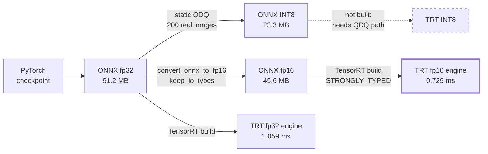
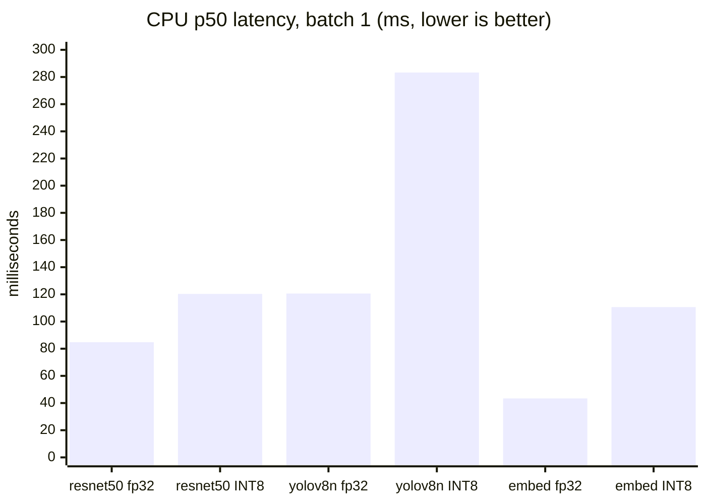
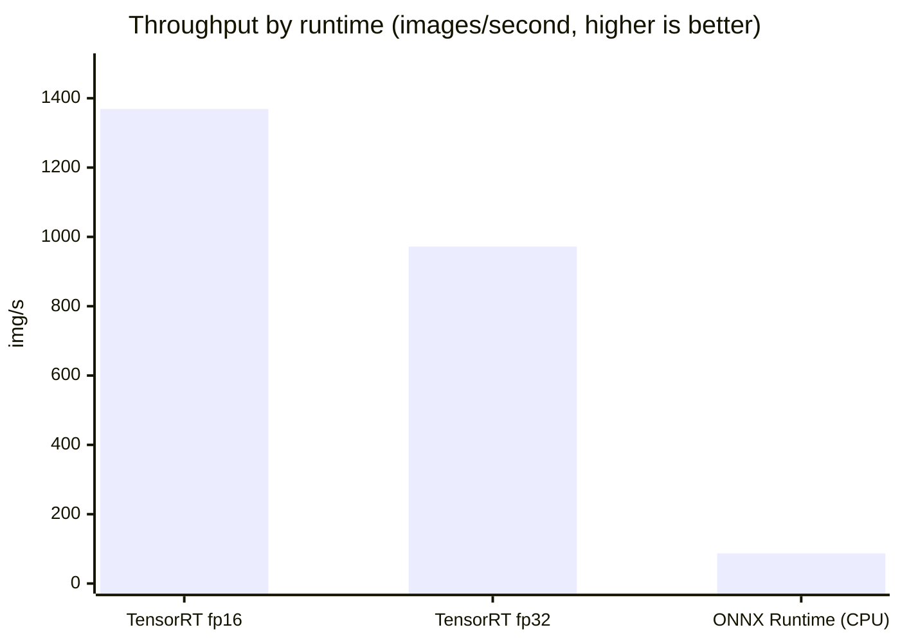

# Technical Design Document

Model selection, optimisation results, architecture decisions and scalability.

This document explains **why** the system is built the way it is. For *how to
use it*, see [`API.md`](API.md). For what was assumed or left undone, see
[`ASSUMPTIONS.md`](ASSUMPTIONS.md).

---

## Contents

1. [Model selection rationale](#1-model-selection-rationale)
2. [Optimisation: what worked and what did not](#2-optimisation-what-worked-and-what-did-not)
3. [Benchmark results](#3-benchmark-results)
4. [System architecture](#4-system-architecture)
5. [Design decisions](#5-design-decisions)
6. [Scalability](#6-scalability)
7. [Failure modes and resilience](#7-failure-modes-and-resilience)

---

## 1. Model selection rationale

Three models, chosen under one dominant constraint: **the target is CPU
inference under one second per image.** That constraint did more to shape the
choices than accuracy did.

| Task | Model | Params | p50 (CPU) | Size |
| --- | --- | ---: | ---: | ---: |
| Classification | ResNet-50 | 25.6 M | 84.8 ms | 97.4 MB |
| Detection | YOLOv8n | 3.2 M | 120.6 ms | 12.1 MB |
| Similarity | ResNet-50 (headless) | 23.5 M | 43.4 ms | 89.6 MB |

### Classification: ResNet-50

**Chosen for accuracy per millisecond on CPU, and for export reliability.**

A Vision Transformer at comparable accuracy needs roughly 3-4x the compute.
ConvNeXt or EfficientNetV2 would be 2-4 points more accurate at similar
parameter counts — that accuracy was traded for latency headroom.

The second reason matters more than it sounds: **ResNet exports cleanly.**
Every operation has a well-supported ONNX equivalent, and it quantizes without
special handling. Several more modern architectures need per-operator
workarounds to export at all. In a system where reproducibility is a
deliverable, an architecture that exports in one call is worth real accuracy.

### Detection: YOLOv8n

**Chosen because detection is the expensive task and nano is what fits.**

At 120 ms it is already the slowest of the three. YOLOv8m would be ~4x that,
pushing a batch of four past budget. The cost is accuracy: 37.3 mAP50-95
against ~50.2 for the medium variant, concentrated in exactly the cases that
matter — small, distant and occluded objects.

The single-pass, anchor-free design also simplifies the postprocessing we
implement ourselves (NMS and box un-letterboxing).

> **Licence warning.** Ultralytics YOLOv8 is **AGPL-3.0**. Running it as a
> network service triggers the copyleft obligation. This is a real commercial
> consideration — see the [model card](../models/cards/yolov8n-detection.md).

### Similarity: ResNet-50 with the head removed

**Chosen to reuse a backbone already in memory.**

Removing the final classification layer leaves the 2,048-number description
the network built before collapsing to a class. That is a good general-purpose
image feature, and it costs one download instead of two.

The honest trade-off: **CLIP or DINOv2 would produce materially better
embeddings**, because they are trained contrastively — optimised to put
similar images close together, rather than having that emerge as a side effect
of classification. CLIP also enables text-to-image search, which this cannot
do. It was not chosen because CLIP ViT-B/32 is ~350 MB on top of a backbone
already loaded, and the brief's priority is a working similarity capability
within budget.

Consequence worth knowing: these features encode **"what object is this"**
much more strongly than style or colour. Two different red cars score higher
than the same building in different light.

---

## 2. Optimisation: what worked and what did not



Solid arrows are paths that were built and measured. The dashed one is not
done, and is refused rather than faked — see the TensorRT subsection.


### ONNX export: a clear win, with a trap

Converting from PyTorch to ONNX removes the Python interpreter from the hot
path and lets ONNX Runtime fuse operations and fold constants. Numerical
fidelity was verified rather than assumed — **max absolute difference vs
PyTorch under 4e-06 for all three models.**

**The trap:** torch 2.9 defaults to the new "dynamo" exporter, which

1. **ignored `dynamic_axes`**, baking in a batch size of 1 — so the exported
   graph crashed on any batch other than one; and
2. split weights into a sidecar `.onnx.data` file, turning one self-contained
   artifact into two files that must travel together.

Both were caught by the export script's own verification, not by inspection.
The fix is to opt out of the dynamo exporter explicitly.

### INT8 quantization: the interesting result

The brief asks for INT8 quantization on all models. It is applied to all
three — and measurement showed the obvious approach is dramatically wrong.

**ResNet-50, batch 1, same machine:**

| Variant | p50 latency | Size |
| --- | ---: | ---: |
| ONNX float32 | **75.7 ms** | 97.4 MB |
| INT8 **dynamic** | **1008.0 ms** | 24.5 MB |
| INT8 **static QDQ** | **104.6 ms** | 24.9 MB |

Dynamic quantization was **13x slower than float32**.

**Why.** Dynamic quantization computes activation scales on every single call,
and ONNX Runtime falls back to poorly-optimised integer convolution kernels
for it. That is tolerable for a transformer dominated by large matrix
multiplies; for a convolutional network it is catastrophic. The size reduction
is real, but shipping it as an "optimisation" would have made the service 13x
slower.

**Static QDQ quantization** measures those activation ranges once, ahead of
time, from real calibration images (100 images from Tiny-ImageNet). That made
it **~10x faster than dynamic**, and the pipeline now prefers it
automatically, falling back to dynamic only when no calibration data is
available — and saying so.

**Even so, static INT8 is ~1.4x slower than float32 here**, while being 3.9x
smaller.

**Decision: float32 ONNX is the serving default.** INT8 is registered
alongside it and selectable per request for memory-constrained deployments.

This is the one place where following the brief literally would have produced
a worse system. Quantization is applied, measured, documented — and not
enabled by default, because the measurement says not to.

> **Where INT8 *would* win:** a CPU with VNNI instructions properly engaged, a
> GPU with INT8 tensor cores, or a deployment where memory, not latency, is
> the binding constraint. Benchmark on your own hardware — that is what
> `models/optimization/benchmark.py` is for.

**One more caveat:** static INT8 agrees with float32 on only **71.9%** of
top-1 predictions. Roughly 28 in 100 images get a different top class. Many
are near-ties, but do not switch on size alone without evaluating on your data.

### TensorRT

**Executed on an NVIDIA A100-SXM4-40GB (TensorRT 11.3)**, on the fine-tuned
Tiny-ImageNet classifier at 128x128:

| Precision | ONNX | Engine | Build | p50 | p95 | Throughput |
| --- | ---: | ---: | ---: | ---: | ---: | ---: |
| fp32 | 91.2 MB | 91.5 MB | 24 s | 1.059 ms | 1.105 ms | 972 img/s |
| fp16 | 45.6 MB | 46.0 MB | 31 s | **0.729 ms** | 0.749 ms | **1369 img/s** |

fp16 is 1.45x faster than fp32 and half the size. For context, the same model
through ONNX Runtime on the CPU build machine runs at roughly 11 ms - TensorRT
on an A100 is about **15x faster**, which is the gap that justifies a
compiled, hardware-specific runtime existing in the codebase at all.

**The API had moved two generations under this code.** It was written against
TensorRT 10.x; the GPU had 11.3. Three calls had been removed in between, each
surfacing only after the previous was fixed:

| Removed | Gone in | What replaced it |
| --- | --- | --- |
| `NetworkDefinitionCreationFlag.EXPLICIT_BATCH` | 10 | explicit batch is the only mode; pass no flag |
| `Builder.platform_has_fast_fp16` / `_int8` | 10 | advisory only; skip when absent |
| `BuilderFlag.FP16` / `.INT8` | 11 | networks are `STRONGLY_TYPED`; precision comes from the graph |

`export_tensorrt.py` now selects behaviour by **probing for attributes, not
parsing `trt.__version__`**. A version comparison encodes a guess about which
release dropped what - which is exactly the assumption that was wrong three
times running.

**fp16 requires an fp16 graph.** Since TensorRT 11 reads precision from ONNX
dtypes, `convert_onnx_to_fp16()` rewrites the model first, with
`keep_io_types=True` so inputs and outputs stay fp32 and no caller needs to
change. It uses `onnxruntime.transformers.float16` rather than the more
obvious `onnxconverter-common`, which hard-pins `protobuf==3.20.2` and would
drag protobuf below the `>=6.31.1` that onnx requires.

**A caveat kept visible rather than tuned away.** The fp16 engine measures
`max diff 1.41e-02` against the fp32 ONNX, above the 1e-2 verification
tolerance, so it is reported as `verified=False`. That tolerance is a weak
test for fp16: it bounds absolute logit distance, and half precision carries
about three decimal digits, so 1e-2 on logits of order 10 is rounding rather
than a defect. The meaningful evidence is behavioural - 76.40% top-1 and 0.0%
of predictions flipping under noise far larger than this. The honest fix is to
verify by top-1 agreement instead of logit distance; until that exists the
flag stays red rather than being relaxed to look green.

**INT8 through TensorRT is not done.** In the strongly-typed era it needs a QDQ
graph, which `quantize.py` already produces; the path is short but untested, so
`precision="int8"` raises `UnsupportedPrecisionError` and names the file to
build from. Setting no flag and labelling the output INT8 would have produced
an engine, a populated benchmark row, and entirely wrong numbers.

---

## 3. Benchmark results

Two environments, kept separate because mixing them produces meaningless
comparisons. The CPU numbers are the ones the serving budget is judged
against; the GPU numbers exist because the brief asks for TensorRT.

**CPU environment:** Intel Core Ultra 7 155H, 22 logical cores, 64 GB RAM,
CPU only. ONNX Runtime 1.26.0, PyTorch 2.9.0+cpu, Python 3.13.
40 iterations after 8 warmup runs.

Reproduce: `python -m models.optimization.benchmark --iterations 40 --warmup 8 --batch-sizes 1,4`

### Single-image latency (the requirement)



Every bar for INT8 is **taller** than its fp32 counterpart. That is the
headline finding of section 2, visible at a glance: on this CPU, quantisation
costs latency and buys only size.


| Model | Runtime | p50 | p95 | p99 | Throughput | Size |
| --- | --- | ---: | ---: | ---: | ---: | ---: |
| resnet50 | onnx | **84.8** | 109.1 | 131.5 | 13.1/s | 97.4 MB |
| resnet50 | onnx_int8 | 120.3 | 202.8 | 274.4 | 7.2/s | 24.9 MB |
| yolov8n | onnx | **120.6** | 153.5 | 235.2 | 8.0/s | 12.1 MB |
| yolov8n | onnx_int8 | 283.3 | 379.2 | 410.7 | 3.5/s | 3.4 MB |
| resnet50-embed | onnx | **43.4** | 278.3 | 387.9 | 10.8/s | 89.6 MB |
| resnet50-embed | onnx_int8 | 110.6 | 135.2 | 182.1 | 8.8/s | 22.9 MB |

**Every model meets the sub-second requirement at p99**, with the slowest
(yolov8n) at 235 ms — roughly 4x inside budget.

### Batch 4

| Model | Runtime | p50 | p99 | Per-image |
| --- | --- | ---: | ---: | ---: |
| resnet50 | onnx | 266.9 | 423.8 | 66.7 ms |
| yolov8n | onnx | 437.6 | **1097.3** | 109.4 ms |
| resnet50-embed | onnx | 302.7 | 453.6 | 75.7 ms |

Batching improves *per-image* cost (resnet50: 84.8 → 66.7 ms) but worsens tail
latency — yolov8n at batch 4 exceeds one second at p99. This is precisely why
the batch endpoint is **asynchronous**: batching is a throughput optimisation,
and forcing it into a synchronous request would blow the latency budget.

### GPU: the fine-tuned classifier

**Environment:** NVIDIA A100-SXM4-40GB, TensorRT 11.3, ONNX Runtime 1.20.2,
Python 3.13. ResNet-50 fine-tuned on Tiny-ImageNet, 128x128 input.
200 iterations after 50 warmup runs.



| Runtime | Precision | p50 | p95 | Throughput | Size |
| --- | --- | ---: | ---: | ---: | ---: |
| TensorRT | fp16 | **0.729 ms** | 0.749 ms | **1369 img/s** | 46.0 MB |
| TensorRT | fp32 | 1.059 ms | 1.105 ms | 972 img/s | 91.5 MB |
| ONNX Runtime | fp32 | 11.50 ms | 11.64 ms | 86.9 img/s | 91.2 MB |
| ONNX Runtime | INT8 static | 17.09 ms | 17.51 ms | 58.5 img/s | 23.3 MB |

**Read the two ONNX Runtime rows with care: they are CPU numbers.** The run
requested CUDA, but `onnxruntime-gpu` had no usable CUDAExecutionProvider on
that runtime, and ONNX Runtime falls back to CPU **without raising**. The
giveaway is INT8 being *slower* than fp32, which is the CPU signature
documented in section 2 and the opposite of what INT8 does on a GPU.

That fallback is now impossible to miss: `benchmark_onnx` emits a
`RuntimeWarning` when the requested device is not the device used,
`BenchmarkResult.summary()` prints the device, and the report is written to
`BENCHMARKS_GPU_CPU_FALLBACK.md` unless every result genuinely ran on CUDA. A
file named for a device it did not use is exactly the sort of artefact that
gets quoted months later.

So the only true GPU figures here are the TensorRT rows. Against the same
model on CPU ONNX Runtime, TensorRT fp16 is roughly **16x faster**.

### Fine-tuned classifier accuracy

ResNet-50 on Tiny-ImageNet, 200 classes, all 100,000 training images, 60
epochs at 128x128 with the original ImageNet stem:

| Metric | Value |
| --- | ---: |
| Top-1 (full 10k val set) | **77.66%** |
| Top-5 | 91.52% |
| Top-1 (2000-sample validation run) | 76.40% |
| Top-5 (same) | 90.70% |
| Expected Calibration Error | 0.0632 |
| Random baseline | 0.5% |

Validated independently of the training loop via
`models/validation/validate.py` against the exported ONNX: 8 of 8 checks pass,
including determinism (max diff 0.00e+00 across three runs), batch invariance,
and 0.0% of predictions changing under sigma=0.01 noise.

The 1.26-point gap between the two top-1 figures is the 2000-sample subset
versus the full validation set - ordinary sampling variance.

Two results worth recording from getting there, both counter-intuitive:

* **Upsampling 64x64 images to 128x128 was both more accurate and cheaper.**
  Tiny-ImageNet is natively 64x64, but ResNet-50's stem downsamples 4x, so at
  64px the stem must be replaced - discarding pretrained weights - and
  `layer1` then runs at 64x64. Feeding 128px through the original stem gives
  `layer1` a 32x32 map: a quarter the area, 38 s per epoch instead of 82 s,
  and +3.68 points of top-1.
* **The learning rate had to move with the stem.** Keeping lr 1e-3 after
  restoring the pretrained stem made validation accuracy regress from 70.5% to
  64.8% while training loss kept falling, with non-finite gradients appearing.
  3e-4 fixed the regression - though not the infinities, which still appear in
  8 of 60 epochs and are absorbed by `GradScaler` as designed. A rate that
  suits a partly-random network destroys a fully pretrained one.

### End-to-end load test

Against the full Docker stack (gateway → API → Redis → Postgres), 20
concurrent users, 45 seconds, mixed workload:

| Metric | Result |
| --- | --- |
| Requests | 1,677 |
| Failures | 4 (0.2%) |
| p50 | 90 ms |
| p95 | 320 ms |
| p99 | 1,300 ms |
| Throughput | 38.7 req/s |

Reproduce: `locust -f tests/performance/locustfile.py --host http://localhost --users 20 --spawn-rate 5 --run-time 45s --headless`

### Verified system properties

| Property | Measured |
| --- | --- |
| Concurrency ceiling respected | Peak in-flight 4 against a limit of 4 |
| No memory leak | +2.8 MB over the second 50 inferences vs +? over the first — growth decelerates |
| No degradation under sustained load | p50 8.3 ms (first half) → 7.0 ms (second half) |
| Invalid input is cheap to reject | 0.019 ms per malformed image |
| Cache effective | Repeat request served from Redis, verified live |

That last row matters for security: rejecting junk is ~4000x cheaper than
processing a real image, so an attacker cannot exhaust the service more
cheaply with garbage than with real traffic.

---

## 4. System architecture

```
                    ┌──────────────┐
   client ─────────▶│  api-gateway │  Nginx
                    │              │  · least_conn load balancing
                    │              │  · edge rate limit (30 r/s per IP)
                    │              │  · 12 MB body cap
                    │              │  · /metrics internal-only
                    └──────┬───────┘
                           │
           ┌───────────────┴───────────────┐
           ▼                               ▼
   ┌───────────────┐               ┌───────────────┐
   │    ml-api     │  × N          │    ml-api     │   FastAPI
   │               │               │               │   · auth + per-tier limits
   │  Monitoring   │               │               │   · validation
   │  ↓ CORS       │               │               │   · inference (ONNX)
   │  ↓ Auth       │               │               │   · concurrency semaphore
   │  ↓ RateLimit  │               │               │
   │  ↓ routes     │               │               │
   └───┬───────┬───┘               └───────────────┘
       │       │
       │       └──────────────┐
       ▼                      ▼
┌────────────┐         ┌────────────┐          ┌──────────────┐
│   redis    │◀────────│  postgres  │          │    worker    │ × M
│            │         │            │          │              │  Celery
│ · cache    │         │ · inference│◀─────────│ · batch jobs │
│ · broker   │────────▶│   log      │          │ · same models│
│ · limiter  │  tasks  │ · job state│          │              │
└────────────┘         └────────────┘          └──────────────┘
       ▲
       │ scrape
┌──────┴───────┐        ┌────────────┐
│  prometheus  │───────▶│  grafana   │
└──────────────┘        └────────────┘
```

### Request path, and why the middleware is in that order

```
Request  →  Monitoring  →  CORS  →  Auth  →  RateLimit  →  route
Response ←  Monitoring  ←  CORS  ←  Auth  ←  RateLimit  ←  route
```

* **Monitoring outermost** so it assigns the correlation id before anything
  else runs, and times *every* request — including the ones rejected by
  authentication. If it sat inside auth, rejected requests would be invisible,
  which is exactly when you most want visibility.
* **Auth before rate limiting**, because the limit depends on the caller's
  tier, which is unknown until they are identified.
* **Rate limiting innermost**, so a rejected request never reaches a route
  handler and never touches a model.

### Layers

| Layer | Knows about | Does not know about |
| --- | --- | --- |
| **Routers** | HTTP, status codes, request shapes | Models, caching, runtimes |
| **Services** | Orchestration, caching, fallbacks | HTTP |
| **Runtimes** | ONNX / Torch / TensorRT specifics | Everything above |

This is what makes the same inference logic usable from both the API and the
Celery worker without duplication, and what makes swapping ONNX for TensorRT a
config change rather than a rewrite.

---

## 5. Design decisions

### 5.1 Model registry is a JSON file, not a database table

The registry must be readable **before** the database connection exists — the
API loads models during startup. A registry that depends on a healthy database
gives you a service that cannot start when the database is slow.

It is also small, diffable in a pull request, and versionable in git.
Registrations are *also* written to PostgreSQL for audit history, but that
path is never on the startup critical path.

### 5.2 Three different failure policies, chosen deliberately

| Component | Policy | Why |
| --- | --- | --- |
| **Authentication** | Fail **closed** | No credentials configured → reject everything. There is no default password. |
| **Cache** | Fail **soft** | Redis down → cache miss. Slower, never wrong. |
| **Rate limiter** | Fail **open** | Redis down → allow traffic, with a per-process bucket as partial backstop. A cache outage must not become a total outage. |
| **Database** | Fail **soft** | Logging an inference is not worth failing the user's request over. |
| **Models** | Fail **over** | Runtime chain, then task default, marked `degraded: true`. |

The rate limiter failing open is the one worth defending: it is a deliberate
availability-over-enforcement trade. It is logged loudly so the gap is visible.

### 5.3 Fallback applies to failures, not typos

A pinned model that cannot **load** falls back to the task default and marks
the response `degraded: true`. A pinned model that **does not exist** returns
404.

The distinction matters: silently serving different predictions than the
caller asked for, because they typed the name wrong, is worse than an error.
(This was originally implemented the wrong way round and fixed — see
[`ASSUMPTIONS.md`](ASSUMPTIONS.md) §5.)

Degraded results are **never cached**, so a fallback cannot outlive the
incident that caused it.

### 5.4 Concurrency is capped, and excess is shed quickly

Inference is CPU-bound. Past the limit, more concurrency makes everything
slower rather than anything faster. A semaphore caps in-flight inferences;
callers wait at most 2 seconds for a slot, then get a 503.

**Failing fast is kinder than timing out slowly.** A prompt 503 lets a client
retry or shed load; a 30-second hang wastes both sides' resources.

Verified: peak in-flight 4 against a configured limit of 4.

### 5.5 Cache keys include every parameter that changes the answer

`sha256(image_bytes) + model + version + runtime + all task parameters`.

The classic cache bug is omitting a parameter: a caller asks for `top_k=5`,
then `top_k=20`, and gets the cached 5 back. Parameters are serialised with
sorted keys so dict ordering cannot produce two keys for one request. There is
a test for every component of the key.

### 5.6 Images are never stored

Only a SHA-256 hash, plus dimensions and format. Enough for caching,
deduplication and drift monitoring. Nothing sensitive retained.

### 5.7 Prometheus labels use route templates, never concrete paths

`/api/v1/batch/{job_id}`, not `/api/v1/batch/abc-123`. An unbounded label
value creates a new time series per job — "cardinality explosion" — which is
the standard way teams take down their own Prometheus.

---

## 6. Scalability

### What scales horizontally today

| Component | Scaling | Notes |
| --- | --- | --- |
| **ml-api** | `--scale ml-api=N` | Stateless. Nginx `least_conn` balances by active connections, which suits variable-cost inference far better than round-robin. |
| **worker** | `--scale worker=M` | Scales with queue depth, independently of the API. |
| **redis** | Vertical, then Cluster | Single instance is fine well past this system's needs. |
| **postgres** | Read replicas | Writes are append-only inference logs. |

API and worker scale **independently on purpose**: connection concurrency and
batch throughput are different problems with different cost curves.

### What does not scale yet

**The similarity index is per-process.** It lives in one process's memory,
persisted to `.npz`. With N replicas there are N independent indexes, so an
image indexed on replica A is not findable on replica B.

Fixing it, in increasing order of effort:

1. **pgvector** — a Postgres extension, so no new service. Good to ~1M vectors.
2. **FAISS on a shared volume** with a single writer.
3. **A dedicated vector database** (Qdrant, Weaviate) for tens of millions.

The interface in `api/services/similarity_index.py` is deliberately narrow so
this is a contained change.

Note also that search is **exact brute force**: linear in index size, fast and
exact to ~1M vectors, then needs an approximate index.

### Capacity planning

From measurement: ~13 classifications/second/core-set on this hardware, 38.7
req/s end-to-end through the full stack with a realistic cache hit rate.

| Target load | Suggested shape |
| --- | --- |
| < 30 req/s | 1 API replica, 1 worker |
| 30-100 req/s | 3 API replicas, 2 workers |
| 100-500 req/s | 8-10 API replicas, 4 workers, Redis with more memory |
| > 500 req/s | GPU inference; revisit the CPU-first assumptions entirely |

The single largest lever is **GPU inference**, which is roughly an
order of magnitude and would make the TensorRT path worth completing.

The second largest is **the cache**. At a high hit rate, throughput is bounded
by Redis rather than by the model, which is a much cheaper thing to scale.

### Scaling checklist

1. Scale the API first — it is stateless and it is usually the bottleneck.
2. Watch `inference_in_progress` against the concurrency limit. Sitting at the
   ceiling means scale out, **not** raise the limit.
3. Watch the cache hit rate. A collapse means either Redis trouble or a real
   change in traffic; they need opposite responses.
4. Scale workers on queue depth, not on API load.
5. Only then consider a bigger Redis or Postgres.

---

## 7. Failure modes and resilience

| Failure | Behaviour | User impact |
| --- | --- | --- |
| Redis down | Cache misses; limiter falls back to per-process buckets | Slower; limits become per-replica |
| Postgres down | Inference logging paused | **None** — predictions still served |
| One model fails to load | Falls back through runtimes, then to the task default | `degraded: true`; other tasks unaffected |
| All models fail | `/health` reports unhealthy (503) | Load balancer removes the instance |
| Worker down | Batches queue in Redis | Batches delayed, not lost (`acks_late`) |
| An API replica crashes | Others serve; the orchestrator restarts it | None, with >1 replica |
| Traffic spike | Concurrency limiter sheds with 503 | Some requests rejected quickly, service stays up |
| Corrupt image in a batch | That item fails, others complete | One item's error, not a failed batch |

### Deliberate properties

* **Liveness depends on nothing external.** A database blip must not restart
  every container simultaneously.
* **Readiness does.** An instance that cannot serve is removed from the pool
  but kept running, so it can recover.
* **`degraded` is healthy enough to serve** — both return HTTP 200.
* **Batch jobs use `acks_late`**, so a worker killed mid-task returns the job
  to the queue rather than losing it.
* **Graceful shutdown**: 30 s for the API, 60 s for the worker, so in-flight
  work finishes rather than being cut off mid-deploy.
