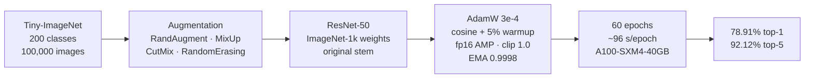
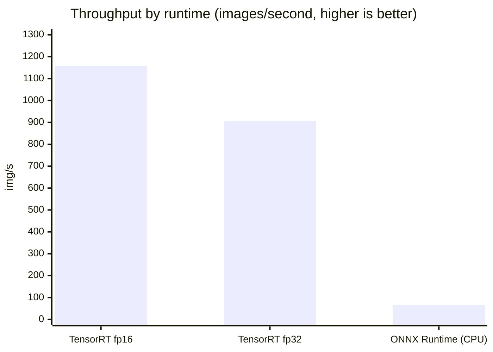
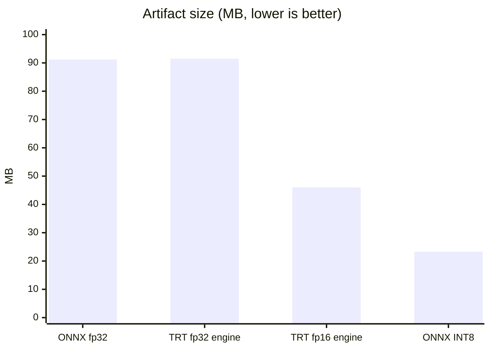

# Model Card — ResNet-50 fine-tuned on Tiny-ImageNet

> A model card is an honest summary of what a model does, how well it does it,
> and — most importantly — where it fails. It exists so that whoever deploys
> the model knows what they are deploying, and whoever reads its output knows
> how far to trust it.

| | |
| --- | --- |
| **Registry name** | `resnet50-tiny-imagenet` |
| **Version** | `1.0.0` |
| **Task** | Image classification |
| **Status** | Registered, not the default classifier — see §6 |
| **Serving endpoint** | `POST /api/v1/classify` with `"model": "resnet50-tiny-imagenet"` |
| **Licence** | Base weights from torchvision (BSD-3-Clause); Tiny-ImageNet terms apply to the fine-tuning data |

---

## 1. What it does

Given one image, it returns a ranked list of the most likely categories from
the 200-class Tiny-ImageNet label set — a subset of ImageNet covering animals,
everyday objects, vehicles and food.

This is the model the brief's fine-tuning requirement produced. It demonstrates
mixed precision, gradient clipping and learning-rate scheduling on a real
dataset, and it is a genuinely working classifier. It is not the default for
`/api/v1/classify`, and §6 explains why.

---

## 2. How it was trained



| Setting | Value |
| --- | --- |
| Base weights | torchvision `IMAGENET1K_V2` |
| Input resolution | 224 × 224 (upsampled from native 64 × 64) |
| Stem | Original ImageNet stem, not adapted |
| Optimiser | AdamW, lr 3e-4, weight decay 5e-2 |
| Schedule | Cosine, 5% linear warmup, 60 epochs |
| Mixed precision | `torch.autocast` fp16 + `GradScaler` |
| Gradient clipping | `clip_grad_norm_`, max norm 1.0, applied after unscaling |
| Label smoothing | 0.1 |
| Augmentation | RandAugment (2 ops @ 0.4), MixUp α=0.2, CutMix α=1.0, RandomErasing p=0.25 |
| Weight averaging | EMA, decay 0.9998, warmed in |
| Early stopping | Off (`--patience 0`) — the run completed all 60 epochs |

All 200 classes and all 100,000 training images were used.
`verify_full_dataset()` refuses to start otherwise.

### Why 224 × 224 for a 64 × 64 dataset

This looks wrong, so it is worth explaining.

ResNet-50's stem is a stride-2 7×7 convolution followed by a stride-2 maxpool,
which reduces its input 4× before the first residual block. Feed it 64px and
`layer1` sees a 16×16 map with far too little spatial detail. The conventional
fix is to replace the stem with a stride-1 3×3 and drop the maxpool. That
works, but it throws away pretrained stem weights and leaves every later layer
running at four times the spatial area.

Feeding a larger input through the original stem uses the network exactly as
pretrained. I measured all three configurations rather than guessing:

| Configuration | s/epoch | Top-1 |
| --- | ---: | ---: |
| 64px, adapted stem, 30 epochs, lr 1e-3 | 82 | 73.98% |
| 128px, original stem, 60 epochs, lr 3e-4 | 38 | 77.66% |
| **224px, original stem, 60 epochs, lr 3e-4, EMA** | **96** | **78.91%** |

The native resolution is the worst of the three and also the second slowest.
Going from 128 to 224 buys 1.25 points for 2.5× the compute, which is a small
return — upsampling adds no information, so the ceiling is the dataset rather
than the input size.

---

## 3. Measured performance

### Accuracy

| Metric | Value |
| --- | ---: |
| Top-1 (full 10,000-image val set) | **78.91%** |
| Top-5 | 92.12% |
| Top-1 (2,000-sample validation run) | 78.60% |
| Top-5 (same) | 91.95% |
| Expected Calibration Error | 0.1244 |
| Random baseline | 0.5% |

The gap between the two top-1 figures is the sample subset against the full
validation set — ordinary sampling variance.

### The training curve

Plotted by `scripts/plot_training_curves.py` directly from
`resnet50_training_history.json`, the file the training loop writes:


**What the curve shows: the long schedule bought a little, and most of it came
at the end.**

| Epoch | Top-1 | Gain from here to best |
| ---: | ---: | ---: |
| 1 | 56.52% | +22.39 |
| 2 | 75.12% | +3.79 |
| 10 | 76.97% | +1.94 |
| 20 | 76.56% | +2.35 |
| 30 | 77.03% | +1.88 |
| 40 | 77.90% | +1.01 |
| 50 | 78.42% | +0.49 |
| **57 (best)** | **78.91%** | — |
| 60 | 78.67% | −0.24 |

Transfer learning from ImageNet-1k weights reaches 75.12% by epoch 2. The
remaining 58 epochs add 3.79 points, and roughly half of that arrives after
epoch 40 when the cosine anneal takes the learning rate down two orders of
magnitude. The long schedule is doing real work here, which was not obvious in
advance — a shorter run would have stopped around 77%.

Validation loss is nearly flat from epoch 10 (1.688) to epoch 60 (1.659) while
training loss falls from 2.13 to 1.39. The model is fitting the training
distribution considerably faster than it is generalising.

**Weight averaging earned its place.** The EMA weights scored higher than the
live weights in 53 of 60 epochs, and the best checkpoint is an EMA one. Early
in the run the gap was around two points; by the final anneal, with the
learning rate tiny and the live weights already settled, it narrowed to a few
tenths. The rightmost panel of the chart shows the seven epochs where the raw
weights won.

**Non-finite gradients occurred in 8 of the 60 epochs** (12, 18, 25, 30, 40,
43, 49, 59). This is normal fp16 behaviour rather than a fault: `GradScaler`
detects the overflow, skips that optimiser step and halves the loss scale. It
is recorded here because an `inf` in a training log looks alarming and is
worth being able to dismiss with evidence.

Total training time: **1.6 hours**, 96 s per epoch.

### Latency, by runtime

TensorRT measured on an NVIDIA A100-SXM4-40GB, 200 iterations after 50 warmup
runs. ONNX Runtime measured on the same box's CPU.



| Runtime | Precision | p50 | p95 | Throughput | Size |
| --- | --- | ---: | ---: | ---: | ---: |
| TensorRT | fp16 | **0.859 ms** | 0.905 ms | **1158 img/s** | 46.0 MB |
| TensorRT | fp32 | 1.099 ms | 1.130 ms | 907 img/s | 91.5 MB |
| ONNX Runtime | fp32 | 14.84 ms | 15.73 ms | 66.4 img/s | 91.2 MB |
| ONNX Runtime | INT8 static | 24.80 ms | 26.84 ms | 40.0 img/s | 23.3 MB |

**The two ONNX Runtime rows are CPU numbers**, not GPU. The run requested CUDA,
but `onnxruntime-gpu` had no usable CUDAExecutionProvider and ONNX Runtime
falls back to CPU without raising. The tell is INT8 being slower than fp32,
which is the CPU signature — on a GPU, INT8 is faster. Only the TensorRT rows
are GPU figures. The benchmark script detects this and names the report
`BENCHMARKS_GPU_CPU_FALLBACK.md` rather than publishing CPU timings under a
GPU filename.

### Size



---

## 4. Validation results

From `python -m models.validation.validate` against the exported ONNX, loaded
through the same `ModelService` the API uses. **Nine of nine checks pass:**

| Check | Result |
| --- | --- |
| Artifact integrity | Pass — all artifacts present |
| Determinism | Pass — max diff 0.00e+00 across 3 runs |
| Batch invariance | Pass — max diff 0.00e+00 |
| Output sanity | Pass — no NaN or infinite values |
| Robustness | Pass — 0.0% of predictions flip under σ=0.01 noise |
| Inference errors | Pass — 0 of 2,000 samples failed |
| Accuracy | Pass — top-1 78.60%, top-5 91.95% on 2,000 samples |
| Calibration | Pass — ECE 0.1244, threshold 0.15 |
| Latency | Pass — p95 33.8 ms on CPU, budget 1,000 ms |

ONNX export fidelity against PyTorch: **max abs diff 3.46e-06**, mean 3.69e-07,
identical top-1 prediction, dynamic batching verified at batch 4.

TensorRT fp16 against the fp32 ONNX: max abs diff **1.25e-02**, which exceeds
the 1e-2 verification tolerance, so it is reported as `verified=False`. That
tolerance is a weak test for fp16 — it bounds absolute logit distance, and half
precision carries about three decimal digits, so 1e-2 on logits of order 10 is
rounding rather than a defect. The behavioural evidence is in the table above.
The flag is left failing rather than relaxed to look green.

### INT8 is smaller, slower, and less accurate

Static QDQ quantization calibrated on 200 real validation images, then measured
on 500 held-out images:

| | fp32 | INT8 static |
| --- | ---: | ---: |
| Size | 95.6 MB | 24.4 MB (3.91× smaller) |
| CPU p50, batch 1 | 14.84 ms | 24.80 ms |
| Top-1 | 76.80% | 65.60% |
| Agreement with fp32 | — | 71.20% |

Nearly four times smaller, but it disagrees with the full-precision model on
almost three images in ten and costs 11 points of top-1. It is registered and
selectable per request; it is not the default, and these numbers are why.

---

## 5. Preprocessing (must match exactly)

| Step | Value |
| --- | --- |
| Resize | Direct resize to 224 × 224 (**stretch**, no crop) |
| Colour | RGB, alpha composited onto white |
| Scale | 0–255 → 0–1 |
| Normalise | Tiny-ImageNet mean/std (`TINY_IMAGENET_MEAN`, `TINY_IMAGENET_STD`) |

A direct resize, not a centre crop, matching the training `EvalTransform`.
This matters more than it looks: a centre crop at `crop_pct=0.875` against a
training pipeline that resizes directly measures 4.28 apart in normalised units
on identical input, with no error and no crash — just quietly worse accuracy in
production than in validation.

`tests/unit/test_preprocessing_parity.py` (17 tests) derives its expected size
from `TINY_IMAGENET_PREPROCESS` rather than hard-coding a number, so changing
the training resolution cannot silently desync the two.

---

## 6. Limitations and failure modes

This is the section that matters most.

### It only knows 200 things, and they are thumbnails

The label set is 200 Tiny-ImageNet classes. Anything outside them is forced
into the nearest one with a confident-looking score. There is no "I don't know"
output.

More subtly, it was fine-tuned on 64×64 source images upsampled to 224px. Its
notion of a "dog" is built from thumbnails. Shown a high-resolution photograph,
it sees a rescaled version that is sharper and differently distributed than
anything it trained on.

### Why it is not the default classifier

The served default for `/api/v1/classify` is ImageNet-1k ResNet-50: 1,000
classes at native 224px. For a general-purpose classification API that is the
better model by a wide margin. The brief asks for both a fine-tuning
demonstration and a production API; this model satisfies the first and would
do a poor job of the second.

Making it the default is a one-line registry change if the 200-class label
space is what you want.

### Confidence is not a probability

ECE 0.1244 is inside the 0.15 threshold the validation pipeline enforces, but
it is not good. Mean confidence is 0.662 against 0.786 accuracy, so the model
is noticeably **under**-confident on this distribution — a score of 0.85 does
not mean 85%. Do not threshold on raw confidence without measuring on your own
data. Temperature scaling would fix this and has not been applied.

### Untested distribution shifts

Not evaluated on medical or satellite imagery, artwork or line drawings, heavy
motion blur, or adversarial inputs. Robustness was tested only against σ=0.01
Gaussian noise, which is a smoke test rather than an adversarial guarantee.

---

## 7. Reproducing it

```bash
python -m models.training.train_classifier \
    --arch resnet50 --epochs 60 --image-size 224 --no-stem-adapt \
    --batch-size 256 --lr 3e-4 --scheduler cosine --warmup-ratio 0.05 \
    --grad-clip 1.0 --label-smoothing 0.1 --patience 0 --ema \
    --device cuda
```

About 1.6 hours on an A100. CPU training is impractical: measured at 3.8 img/s
for the adapted-stem configuration, which is 9.4 days for 30 epochs.

**Two settings that are traps.**

*Early stopping.* Leave it at `--patience 0`. A cosine schedule does most of
its work in the final anneal, so validation accuracy plateaus mid-run as a
matter of course. A patience of 15 ended a 60-epoch run at epoch 32 with the
learning rate still at 86% of maximum, and a patience of 8 ended two earlier
runs around epoch 9. Early stopping suits `--scheduler plateau` or `step`; with
a fixed-length schedule it discards the part that pays.

*Learning rate.* 3e-4, not the 1e-3 that suited the adapted-stem
configuration. With the whole pretrained network intact, 1e-3 makes validation
accuracy regress — 70.5% down to 64.8% while training loss keeps falling — with
non-finite gradients appearing. The learning rate has to move when the stem
does.

**Long runs on a hosted GPU need a mirror.** Pass
`--mirror-dir /content/drive/MyDrive/<folder>/checkpoints` so checkpoints land
somewhere that outlives the container. Without it, a recycled runtime costs the
whole run.

---

## 8. Maintenance

| | |
| --- | --- |
| **Trained** | September 2026, NVIDIA A100-SXM4-40GB, TensorRT 11.3 |
| **Retrain when** | The label space changes, or drift detection flags a sustained shift |
| **Drift monitoring** | `models/validation/drift.py` — KS test, chi-square, PSI |
| **Regression gate** | `models/validation/regression.py` — fails the build if accuracy drops against the recorded baseline |
| **Owner** | See repository maintainers |

Related: [`resnet50-classification.md`](resnet50-classification.md) (the served
default), [`docs/ASSUMPTIONS.md`](../../docs/ASSUMPTIONS.md) §1.2 and §2.1,
[`docs/TECHNICAL.md`](../../docs/TECHNICAL.md) §3.
