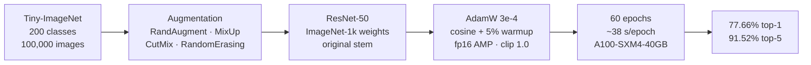
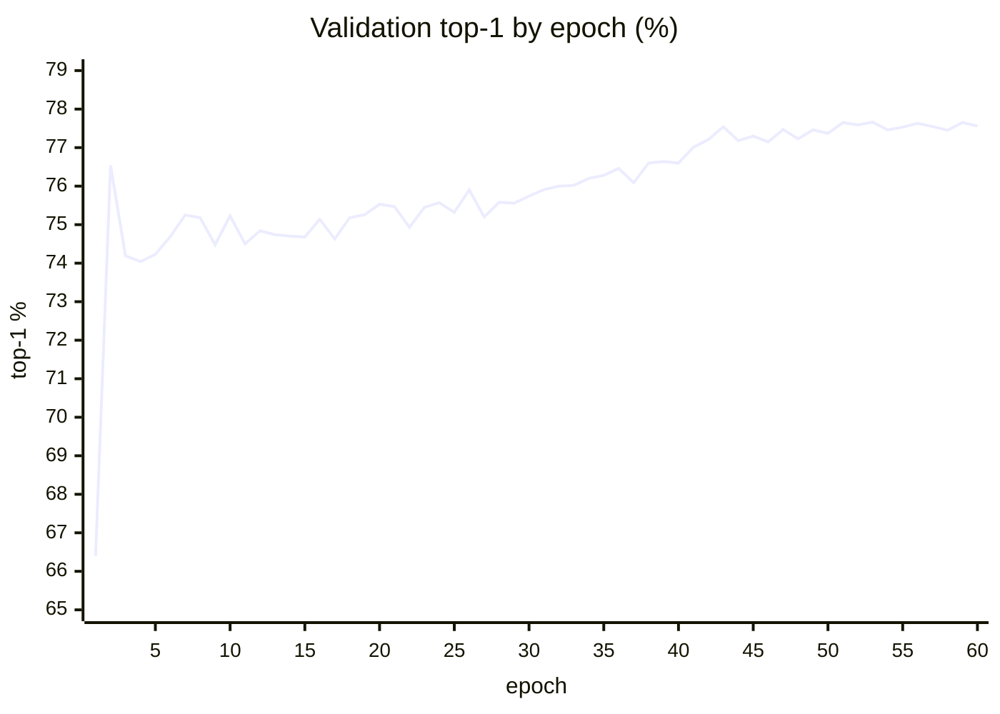
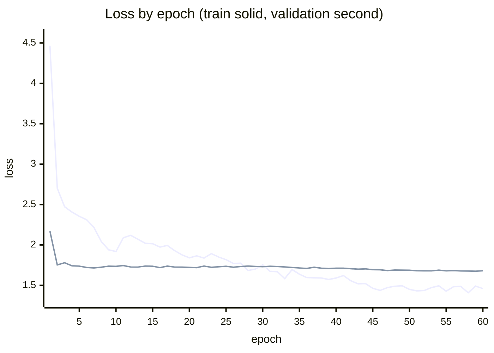
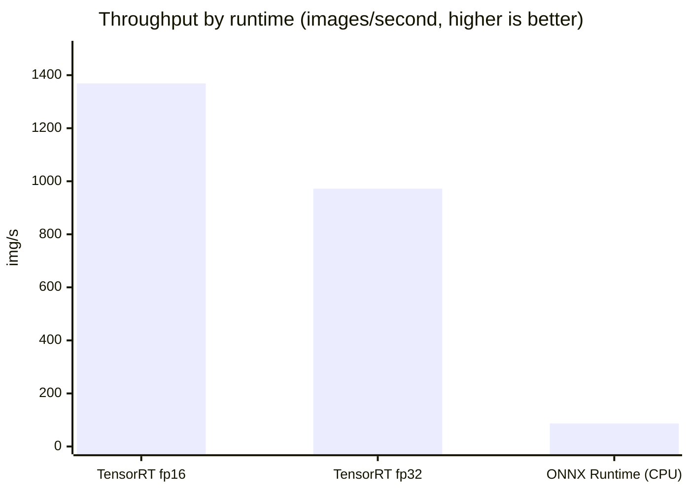
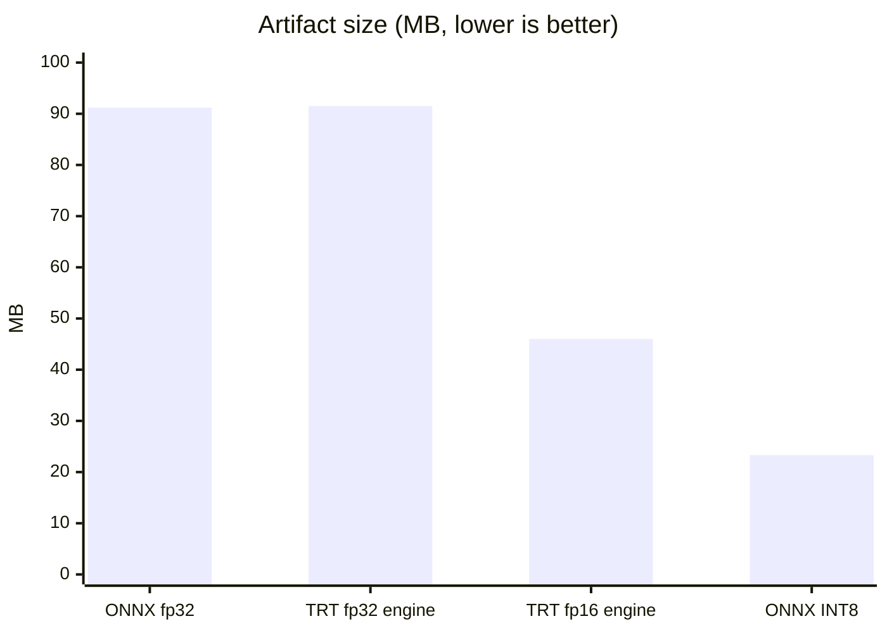

# Model Card — ResNet-50 fine-tuned on Tiny-ImageNet

> A model card is an honest summary of what a model does, how well it does it,
> and — most importantly — where it fails. It exists so that whoever deploys
> the model knows what they are deploying, and whoever consumes its output
> knows how far to trust it.

| | |
| --- | --- |
| **Registry name** | `resnet50-tiny-imagenet` |
| **Version** | `1.0.0` |
| **Task** | Image classification |
| **Status** | Registered, **not** the default classifier — see §6 |
| **Serving endpoint** | `POST /api/v1/classify` with `"model": "resnet50-tiny-imagenet"` |
| **Licence** | Base weights from torchvision (BSD-3-Clause); Tiny-ImageNet terms apply to the fine-tuning data |

---

## 1. What it does

Given one image, it returns a ranked list of the most likely categories from
the **200-class Tiny-ImageNet label set** — a subset of ImageNet covering
animals, everyday objects, vehicles and food.

This is the model the brief's fine-tuning requirement produced. It exists to
demonstrate mixed precision, gradient clipping and learning-rate scheduling on
a real dataset, and it is a genuinely working classifier — but it is **not**
the default for `/api/v1/classify`. See §6 for why.

---

## 2. How it was trained



| Setting | Value |
| --- | --- |
| Base weights | torchvision `IMAGENET1K_V2` |
| Input resolution | 128 x 128 (upsampled from native 64 x 64) |
| Stem | **Original** ImageNet stem, not adapted |
| Optimiser | AdamW, lr 3e-4, weight decay 5e-2 |
| Schedule | Cosine, 5% linear warmup, 60 epochs |
| Mixed precision | `torch.autocast` fp16 + `GradScaler` |
| Gradient clipping | `clip_grad_norm_`, max norm 1.0, after unscaling |
| Label smoothing | 0.1 |
| Augmentation | RandAugment (2 ops @ 0.4), MixUp α=0.2, CutMix α=1.0, RandomErasing p=0.25 |
| Early stopping | Disabled (`--patience 0`) — the run completed all 60 epochs |

All 200 classes and all 100,000 training images were used.
`verify_full_dataset()` refuses to start otherwise.

### Why 128 x 128 for a 64 x 64 dataset

This looks wrong and is the single most important decision here.

ResNet-50's stem is a stride-2 7x7 convolution followed by a stride-2 maxpool,
reducing its input 4x before the first residual block. Feed it 64px and
`layer1` sees 16x16 — too little spatial detail — so the conventional fix is to
replace the stem with a stride-1 3x3 and drop the maxpool. That works, but it
throws away pretrained stem weights and leaves `layer1` running at 64x64.

Feeding 128px through the **original** stem gives `layer1` a 32x32 map and uses
the network exactly as pretrained. It is both more accurate and *cheaper*:

| Configuration | s/epoch | Top-1 |
| --- | ---: | ---: |
| 64px, adapted stem, 30 epochs, lr 1e-3 | 82 | 73.98% |
| **128px, original stem, 60 epochs, lr 3e-4** | **38** | **77.66%** |

---

## 3. Measured performance

### Accuracy

| Metric | Value |
| --- | ---: |
| Top-1 (full 10,000-image val set) | **77.66%** |
| Top-5 | 91.52% |
| Top-1 (2,000-sample validation run) | 76.40% |
| Top-5 (same) | 90.70% |
| Expected Calibration Error | 0.0632 |
| Random baseline | 0.5% |

The 1.26-point gap between the two top-1 figures is the sample subset versus
the full validation set — ordinary sampling variance.

### The training curve

Real per-epoch validation accuracy from
`resnet50_training_history.json` (60 epochs, no early stopping):





**An honest reading of this curve: the long schedule bought very little.**

| Epoch | Top-1 | Gain from here to best |
| ---: | ---: | ---: |
| 1 | 66.40% | +11.26 |
| 2 | 76.54% | +1.12 |
| 10 | 75.23% | +2.43 |
| 30 | 75.74% | +1.92 |
| 50 | 77.37% | +0.29 |
| **53 (best)** | **77.66%** | — |
| 60 | 77.56% | -0.10 |

Transfer learning from ImageNet-1k weights reaches **76.54% by epoch 2**. The
remaining 58 epochs add 1.12 points, almost all of it in the final cosine
anneal after epoch 40. The schedule was chosen on the reasoning that heavy
augmentation (MixUp, CutMix, RandAugment) needs a long run to pay off; the data
only partly supports that. Around 25-30 epochs would have captured most of the
benefit for half the compute.

Validation loss tells the same story - it is essentially flat from epoch 6
(1.721) to epoch 60 (1.680) while training loss falls from 2.31 to 1.46. The
model is fitting the training distribution far more than it is generalising
further.

**Non-finite gradients occurred in 8 of the 60 epochs** (6, 9, 20, 31, 38, 44,
52, 57). This is normal fp16 behaviour, not a fault: `GradScaler` detects the
overflow, skips that optimiser step and halves the loss scale. It is recorded
here because an `inf` in a training log looks alarming and is worth being able
to dismiss with evidence.

**Total wall-clock: 33.9 minutes**, 36.5 s per epoch on average.

### Latency, by runtime

Measured on an NVIDIA A100-SXM4-40GB, 200 iterations after 50 warmup runs.



| Runtime | Precision | p50 | p95 | Throughput | Size |
| --- | --- | ---: | ---: | ---: | ---: |
| TensorRT | fp16 | **0.729 ms** | 0.749 ms | **1369 img/s** | 46.0 MB |
| TensorRT | fp32 | 1.059 ms | 1.105 ms | 972 img/s | 91.5 MB |
| ONNX Runtime | fp32 | 11.50 ms | 11.64 ms | 86.9 img/s | 91.2 MB |
| ONNX Runtime | INT8 static | 17.09 ms | 17.51 ms | 58.5 img/s | 23.3 MB |

**The two ONNX Runtime rows are CPU numbers**, not GPU. The run requested CUDA
but `onnxruntime-gpu` had no usable CUDAExecutionProvider, and ONNX Runtime
falls back to CPU without raising. The tell is INT8 being *slower* than fp32,
which is the CPU signature — on a GPU INT8 is faster. Treat only the TensorRT
rows as GPU figures.

### Size



---

## 4. Validation results

From `python -m models.validation.validate` against the exported ONNX —
**8 of 8 checks pass**:

| Check | Result |
| --- | --- |
| Artifact integrity | Pass — all artifacts present |
| Determinism | Pass — max diff 0.00e+00 across 3 runs |
| Batch invariance | Pass — max diff 0.00e+00 |
| Output sanity | Pass — no NaN or infinite values |
| Robustness | Pass — 0.0% of predictions flip under σ=0.01 noise |
| Accuracy | Pass — top-1 76.40%, top-5 90.70% on 2,000 samples |
| Calibration | Pass — ECE 0.0632, threshold 0.15 |
| Latency | Pass — p95 7.1 ms, budget 1,000 ms |

ONNX export fidelity against PyTorch: **max abs diff 1.91e-06**.

TensorRT fp16 against the fp32 ONNX: max abs diff **1.41e-02**, which exceeds
the 1e-2 verification tolerance, so it is reported as `verified=False`. That
tolerance is a weak test for fp16 — it bounds absolute logit distance, and half
precision carries about three decimal digits, so 1e-2 on logits of order 10 is
rounding, not a defect. The behavioural evidence is above. The flag is left
failing rather than relaxed to look green.

---

## 5. Preprocessing (must match exactly)

| Step | Value |
| --- | --- |
| Resize | Direct resize to 128 x 128 (**stretch**, no crop) |
| Colour | RGB, alpha composited onto white |
| Scale | 0-255 → 0-1 |
| Normalise | Tiny-ImageNet mean/std (`TINY_IMAGENET_MEAN`, `TINY_IMAGENET_STD`) |

A **direct resize, not a centre crop** — matching the training `EvalTransform`.
This is not a stylistic choice: an earlier version of this config centre-cropped
at `crop_pct=0.875` while training resized directly, a mismatch measuring 4.28
in normalised units on identical input, with no error and no crash — just
quietly worse accuracy in production than in validation.

`tests/unit/test_preprocessing_parity.py` (17 tests) now derives its expected
size from `TINY_IMAGENET_PREPROCESS` rather than hard-coding a number, so
changing the training resolution cannot silently desync the two again.

---

## 6. Limitations and failure modes

This is the section that matters most.

### It only knows 200 things, and they are thumbnails

The label set is 200 Tiny-ImageNet classes. Anything outside them is forced
into the nearest one with a confident-looking score. There is no "I don't
know" output.

More subtly, it was fine-tuned on **64x64 source images upsampled to 128px**.
Its notion of a "dog" is built from thumbnails. On a high-resolution
photograph it sees a rescaled version that is sharper and differently
distributed than anything in training.

### This is why it is not the default classifier

The served default for `/api/v1/classify` is ImageNet-1k ResNet-50: 1,000
classes at native 224px. For a general-purpose classification API that is the
better model by a wide margin, and the brief asks for both a fine-tuning
demonstration and a production API. This model satisfies the first; it would
make a poor job of the second.

Making it the default is a one-line registry change if the 200-class label
space is what you want.

### Calibration is decent but not a probability

ECE 0.0632 means confidence scores track accuracy reasonably — but a "0.85"
is not an 85% guarantee. Mean confidence is 0.724 against 0.764 accuracy, so
it is mildly **under**-confident on this distribution. Do not threshold on raw
confidence without measuring on your own data.

### Untested distribution shifts

Not evaluated on: medical or satellite imagery, artwork or line drawings,
heavy motion blur, adversarial inputs. Robustness was tested only against
σ=0.01 Gaussian noise, which is a smoke test, not an adversarial guarantee.

---

## 7. Reproducing it

```bash
python -m models.training.train_classifier \
    --arch resnet50 --epochs 60 --image-size 128 --no-stem-adapt \
    --batch-size 256 --lr 3e-4 --scheduler cosine --warmup-ratio 0.05 \
    --grad-clip 1.0 --label-smoothing 0.1 --patience 15 --device cuda
```

Roughly 38 minutes on an A100. CPU training is impractical — measured at 3.8
img/s for the adapted-stem configuration, which is 9.4 days for 30 epochs.

**Two settings that are traps.**

*Early stopping.* The default is `--patience 0` (off). It was 8, and it
terminated three separate runs at epoch 9. A cosine schedule does most of its
work in the final anneal, so a mid-run plateau is expected rather than a signal
to stop. If it fires before roughly epoch 45, suspect the plateau, not the
model.

*Learning rate.* 3e-4, not the 1e-3 that suited the adapted-stem
configuration. With the whole pretrained network intact, 1e-3 made validation
accuracy **regress** from 70.5% to 64.8% while training loss kept falling, with
non-finite gradients appearing. The learning rate has to move when the stem
does.

---

## 8. Maintenance

| | |
| --- | --- |
| **Trained** | September 2026, NVIDIA A100-SXM4-40GB, TensorRT 11.3 |
| **Retrain when** | The label space changes, or drift detection flags a sustained shift |
| **Drift monitoring** | `models/validation/drift.py` — KS test, chi-square, PSI |
| **Regression gate** | `models/validation/regression.py` — fails the build if accuracy drops against the recorded baseline |
| **Owner** | See repository maintainers |

Related: [`resnet50-classification.md`](resnet50-classification.md) (the served
default), [`docs/ASSUMPTIONS.md`](../../docs/ASSUMPTIONS.md) §1.2 and §2.2,
[`docs/TECHNICAL.md`](../../docs/TECHNICAL.md) §3.
